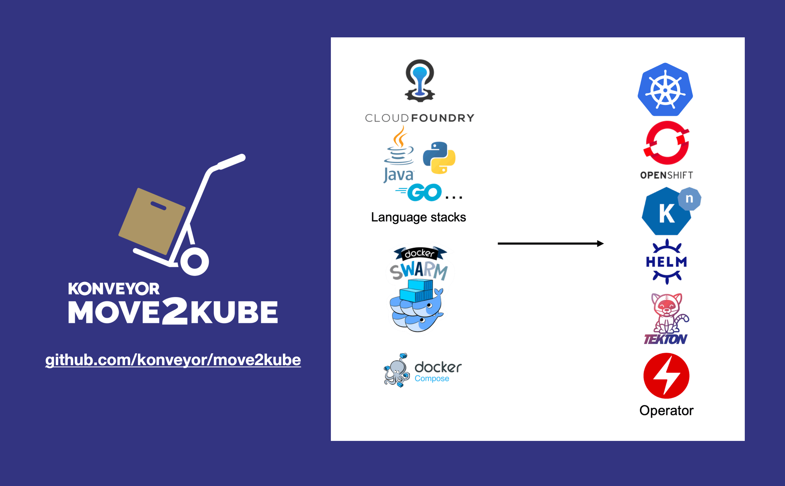

[](https://github.com/konveyor/move2kube/actions?query=workflow%3ABuild)
[](https://quay.io/repository/konveyor/move2kube)
[](https://www.apache.org/licenses/LICENSE-2.0.html)
[](https://goreportcard.com/report/github.com/konveyor/move2kube)
[](https://kubernetes.slack.com/archives/CR85S82A2)

# Move2Kube

Move2Kube is a command-line tool that accelerates the process of re-platforming to Kubernetes/Openshift. It does so by analyzing the environment and source artifacts, and asking guidance from the user when required. It allows customizations to enable generating the directory structure and artifacts in the format required for your project.



## Installation

### Using install script

To install the latest stable version:

```shell
bash <(curl https://raw.githubusercontent.com/konveyor/move2kube/main/scripts/install.sh)
```

To install a specific version (for example version `v0.2.0-alpha.3`):

```shell
MOVE2KUBE_TAG='v0.2.0-alpha.3' bash <(curl https://raw.githubusercontent.com/konveyor/move2kube/main/scripts/install.sh)
```

To install the bleeding edge version:

```shell
BLEEDING_EDGE='true' bash <(curl https://raw.githubusercontent.com/konveyor/move2kube/main/scripts/install.sh)
```

### Using Homebrew

```shell
brew tap konveyor/move2kube
brew install move2kube
```

## UI

To bring up UI version:

Using `docker`:

```shell
docker run --rm -it -p 8080:8080 quay.io/konveyor/move2kube-ui:latest
```

Using `podman`:

```shell
podman run --rm -it -p 8080:8080 quay.io/konveyor/move2kube-ui:latest
```

Then go to http://localhost:8080 in a browser

More detailed instructions can be found in the [Move2Kube UI repo](https://github.com/konveyor/move2kube-ui#starting-the-ui)

## Usage

`move2kube transform -s src`, where `src` is the folder containing the source artifacts.

Checkout the [Getting started](https://move2kube.konveyor.io/docs/getting-started) guide and [Tutorials](https://move2kube.konveyor.io/docs/tutorial) for more information.

## Development environment setup

To browse code [](https://open.vscode.dev/konveyor/move2kube)

1. Obtain a recent version of `golang`. Known to work with `1.17`.
1. Ensure `$GOPATH` is set. If it's not set:
   1. `mkdir ~/go`
   1. `export GOPATH=~/go`
1. Obtain this repo:
   1. `mkdir -p $GOPATH/src/`
   1. Clone this repo into the above directory.
   1. `cd $GOPATH/src/move2kube`
1. Build: `make build`
1. Run unit tests: `make test`

## Artifacts Required

| Source | Artifact available | Features supported |
|:-------|:-------------------|:-------------------|
| Cloud Foundry | Manifest files, Source code | Containerization options based on source code, Deployment artifacts |
| Cloud Foundry | Manifest files, Source code, Access to running instance | Containerization options based on source code, Deployment artifacts, Metadata from runtime |
| Dockerfile | Dockerfile | Deployment artifacts, CI/CD pipeline artifacts |
| Docker Compose/Swarm | Docker compose files | Deployment artifacts |
| Docker Compose/Swarm | Docker compose files, Docker images | Deployment artifacts, CI/CD pipeline artifacts |
| Source Directories | Source code with no source metadata |  Containerization options based on source code, Deployment artifacts, CI/CD artifacts |
| Kubernetes Yamls | Kubernetes Yamls | Parameterize and create Helm chart, Kustomize yamls and Openshift templates. |

## Output

* Deployment artifacts
  * Dockerfile
  * Kubernetes/Openshift Yamls
  * Helm charts
  * Kustomize
  * OpenShift Templates
  * Docker compose

## Discussion

* For any questions reach out to us on any of the communication channels given on our website https://move2kube.konveyor.io/
