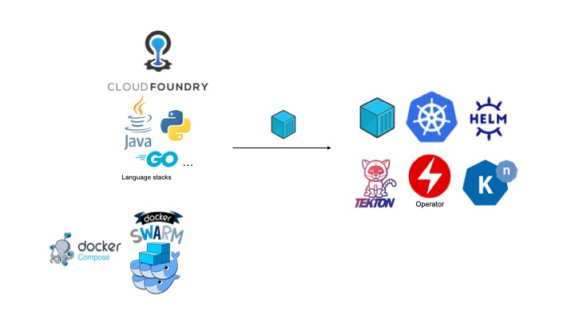

# Move2Kube

Move2Kube is a command-line tool that accelerates the process of re-platforming to Kubernetes/Openshift. It does so by analysing the environment and source artifacts, and asking guidance from the user when required.

## Install

Command line :

* `bash <(curl https://raw.githubusercontent.com/konveyor/move2kube/main/scripts/install.sh)`

UI :

* `git clone git@github.com:konveyor/move2kube-ui.git`
* `cd move2kube-ui` and run `docker-compose up`
* The UI will now be accessible in `http://localhost:8080`.

## Usage

### Simple Usage

`move2kube translate -s src` , where src is the folder containing the source artifacts.

### Involved Usage

Usage instructions can be found [here](./USAGE.md)  
Some demo usage flows can be found in [here](https://github.com/konveyor/move2kube-demos)

## Prerequisites

* Docker [(MAC](https://docs.docker.com/desktop/)[/Ubuntu](https://docs.docker.com/engine/install/ubuntu/)[/Windows WSL)](https://docs.docker.com/docker-for-windows/wsl/) - If Cloud Native Buildpack (CNB) support is required.

## Development environment setup

1. Obtain a recent version of `golang`. Known to work with `1.15`.
1. Ensure `$GOPATH` is set. If it's not set:
   1. `mkdir ~/go`
   1. `export GOPATH=~/go`
1. Obtain this repo:
   1. `mkdir -p $GOPATH/src/`
   1. Clone this repo into the above directory.
   1. `cd $GOPATH/src/move2kube`
1. Build: `make build`
1. Run unit tests: `make test`

## Artifacts Required

| Source | Artifact available | Features supported |
|:-------|:-------------------|:-------------------|
| Cloud Foundry | Manifest files | Containerization options from buildpacks, Deployment artifacts |
| Cloud Foundry | Manifest files, Source code | Containerization options based on buildpack/source code, Deployment artifacts |
| Cloud Foundry | Manifest files, Source code, Access to running instance | Containerization options based on buildpack/source code, Deployment artifacts, Metadata from runtime |
| Cloud Foundry | Access to running instance |  Metadata from runtime, Containerization options based on buildpack, Deployment artifacts |
| Docker Compose/Swarm | Docker compose files | Deployment artifacts |
| Docker Compose/Swarm | Docker compose files, Docker images | Deployment artifacts, Ability to enhance images to run in secure environments like Openshift. |
| Source Directories | Source code with no source metadata |  Containerization options based on source code, Deployment artifacts |
| Any source | Access to target cluster | Ability to create artifacts customized for that particular cluster with the most preferred GroupVersion for the kind. |

## Output

* Containerization scripts
  * Dockerfile
  * Source 2 Image (S2I)
  * Cloud Native Buildpack
* Deployment artifacts
  * Kubernetes/Openshift Yamls
  * Helm charts
  * Operator
  * Docker compose

## Move2Kube Demo
* A short demo of using Move2Kube end-to-end, i.e., starting from the generation of the target deployment artifacts using the source artifacts, to finally deploying the applications on Kubernetes using the generated target artifacts, can be watched in the below link.

  

## Discussion

* Check out the [document guides](./docs) to extend Move2Kube.
* For any questions reach out to us on any of the communication channels given on our website https://konveyor.io/move2kube/
