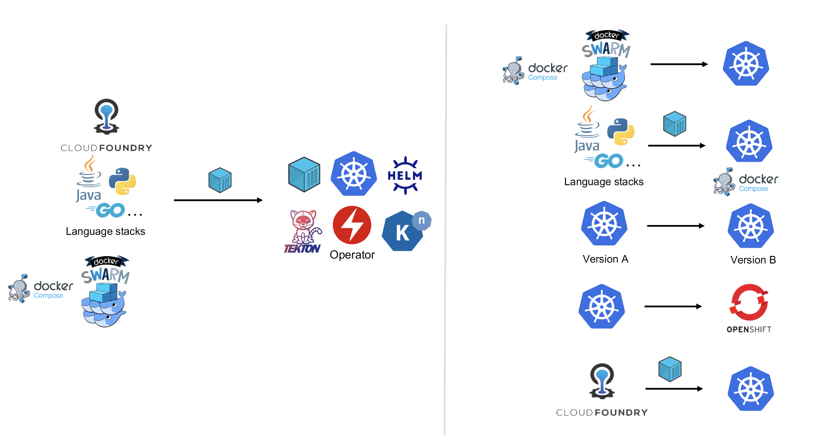

## Tutorials

Tutorials about using Move2Kube to generate target artifacts for various source platforms can be found below.

* [End-to-End Flow]({{ site.baseurl }}/tutorials/e2e-flow)
* [Cloud Foundry]({{ site.baseurl }}/tutorials/cloud-foundry)
* [Docker Compose]({{ site.baseurl }}/tutorials/docker-compose)
* [Dockerfile Containerization]({{ site.baseurl }}/tutorials/dockerfile-containerization)
* [Kubernetes-to-Kubernetes]({{ site.baseurl }}/tutorials/kubernetes-to-kubernetes)
* [Language Platforms]({{ site.baseurl }}/tutorials/language-platforms)
* [UI Local Machine Workflow]({{ site.baseurl }}/tutorials/ui-local-workflow)
