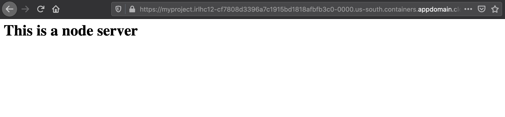

# Migrating and deploying Cloud Foundry applications to Kubernetes

## Description

This document explains steps that will install move2kube and use 3 step process to collect, containerize, and create deployment artifacts for cloud foundry apps. It also takes through the process to customize for a specific cluster. Here, we are going to use the data from [samples/cloud-foundry](https://github.com/konveyor/move2kube-demos/tree/main/samples/cloud-foundry).


## Prerequisites

1. Install Move2Kube.

   ```console
   $ bash <(curl https://raw.githubusercontent.com/konveyor/move2kube/master/scripts/install.sh)
   ```

2. Install dependencies.
  * [Docker](https://www.docker.com/get-started)
  * [operator-sdk](https://docs.openshift.com/container-platform/4.1/applications/operator_sdk/osdk-getting-started.html#osdk-installing-cli_osdk-getting-started)
  * [kubectl](https://kubernetes.io/docs/tasks/tools/install-kubectl/)
  * [Pack](https://buildpacks.io/docs/tools/pack/)

   For convenience, we have provided a script which can help you to install all these dependencies in one go.

   ```console
   $ bash <(curl https://raw.githubusercontent.com/konveyor/move2kube/master/scripts/installdeps.sh)
   ```
   To verify that dependencies were correctly installed
   ```console
   $ operator-sdk version
   ```
   ```console
   $ docker version
   ```
   ```console
   $ pack version
   ```
   ```console
   $ kubectl version
   ```
3. Install [Cloud Foundry CLI](https://docs.cloudfoundry.org/cf-cli/install-go-cli.html)

4. Clone the [move2kube-demos](https://github.com/konveyor/move2kube-demos) repository

   ```console
   $ git clone https://github.com/konveyor/move2kube-demos.git
   ```

   ```console
   $ cd move2kube-demos
   ```
   Let's see the structure inside the `samples/cloud-foundry` directory.

   ```console
   move2kube-demos git:(main) $ tree samples/cloud-foundry
   samples/cloud-foundry
   ├── cfapps.yaml
   ├── cluster.yaml
   ├── main.js
   ├── manifest.yml
   ├── package-lock.json
   └── package.json
   ```
5. We will deploy a simple nodejs application into Cloud Foundry. If you have a CF app already you may use that instead. Provision a CF app with the name `move2kube-demo-cf` using your cloud provider (Ex: [IBM Cloud](https://cloud.ibm.com/)).
   1. Make note of the API endpoint (API endpoints for the IBM Cloud Foundry service can be found [here](https://cloud.ibm.com/docs/cloud-foundry-public?topic=cloud-foundry-public-endpoints)).
   2. Login to cf using
       ```console
       move2kube-demos git:(main) $ cf login -a <YOUR CF API endpoint>
       ```
   3. From the root folder of this repo run this to deploy the sample application
       ```console
       move2kube-demos git:(main) $ cf push -f ./samples/cloud-foundry/
       ```
   4. Go to the URL of the application (you can get this by running `cf apps`) to see it running.


## Steps to generate target artifacts

Now that we have a running Cloud Foundry app we can translate it using Move2Kube. We will be using the the three stage process for the translation. Run these steps from the `samples/` folder:

1. We will first collect some data about your running CF application and any kubernetes clusters
    ```console
    move2kube-demos git:(main) $ cd samples
    samples git:(main) $ move2kube collect
    INFO[0000] Begin collection                             
    INFO[0000] [*collector.ClusterCollector] Begin collection
    INFO[0006] [*collector.ClusterCollector] Done           
    INFO[0006] [*collector.ImagesCollector] Begin collection
    INFO[0006] [*collector.ImagesCollector] Done            
    INFO[0006] [*collector.CFContainerTypesCollector] Begin collection
    INFO[0013] [*collector.CFContainerTypesCollector] Done  
    INFO[0013] [*collector.CfAppsCollector] Begin collection
    INFO[0020] [*collector.CfAppsCollector] Done            
    INFO[0020] Collection done                              
    INFO[0020] Collect Output in [/Users/go/src/move2kube-demos/samples/m2k_collect]. Copy this directory into the source directory to be used for planning.
    ```

    * The data we collected will be stored in a new folder called `m2k_collect`. Move this into the source directory.

    ```console
    samples git:(main) $ ls m2k_collect
    cf       clusters

    samples git:(main) $ mv m2k_collect/ cloud-foundry/m2k_collect
    ```

    * The `m2k_collect/cf` folder contains the yaml file which has the runtime information of the particular application that you are trying to translate. There is information about the buildpacks that are supported, the memory, the number of instances and the ports that are supported. If there is an environment variable, it would have collected that information too.
    * The `m2k_collect/clusters` has the cluster metadata yaml file which has the target cluster information.
    * For this tutorial, we have copied these files into the source directory already and renamed them as [*cfapps.yaml*](https://github.com/konveyor/move2kube-demos/blob/main/samples/cloud-foundry/cfapps.yaml) and [*cluster.yaml*](https://github.com/konveyor/move2kube-demos/blob/main/samples/cloud-foundry/cluster.yaml).

2. Then we create a *plan* on how to translate your app to run on Kubernetes. In the plan phase, it is going to combine the runtime artifacts with source artifacts and going to come up with a *plan* for us.
    ```console
    samples git:(main) $ move2kube plan -s cloud-foundry
    INFO[0000] Planning Translation                         
    INFO[0000] [*source.DockerfileTranslator] Planning translation
    INFO[0000] [*source.DockerfileTranslator] Done          
    INFO[0000] [*source.ComposeTranslator] Planning translation
    INFO[0000] [*source.ComposeTranslator] Done             
    INFO[0000] [*source.CfManifestTranslator] Planning translation
    INFO[0004] [*source.CfManifestTranslator] Done          
    INFO[0004] [*source.KnativeTranslator] Planning translation
    INFO[0004] [*source.KnativeTranslator] Done             
    INFO[0004] [*source.KubeTranslator] Planning translation
    INFO[0004] [*source.KubeTranslator] Done                
    INFO[0004] [*source.Any2KubeTranslator] Planning translation
    INFO[0004] [*source.Any2KubeTranslator] Done            
    INFO[0004] Translation planning done                    
    INFO[0004] Planning Metadata                            
    INFO[0004] [*metadata.ClusterMDLoader] Planning metadata
    INFO[0004] [*metadata.ClusterMDLoader] Done             
    INFO[0004] [*metadata.K8sFilesLoader] Planning metadata
    INFO[0004] [*metadata.K8sFilesLoader] Done              
    INFO[0004] [*metadata.QACacheLoader] Planning metadata  
    INFO[0004] [*metadata.QACacheLoader] Done               
    INFO[0004] Metadata planning done                       
    INFO[0004] Plan can be found at [/Users/go/src/move2kube-demos/samples/m2k.plan].
    ```
    * It has created a *m2k.plan* which is essentially a yaml file. Let's see what is inside the plan file.

    ```console
    samples git:(main) $ cat m2k.plan
    apiVersion: move2kube.konveyor.io/v1alpha1
    kind: Plan
    metadata:
      name: myproject
    spec:
      inputs:
        rootDir: cloud-foundry
        services:
          move2kube-demo-cf:
            - serviceName: move2kube-demo-cf
              serviceRelPath: /move2kube-demo-cf
              image: move2kube-demo-cf:latest
              translationType: Cfmanifest2Kube
              containerBuildType: NewDockerfile
              sourceType:
                - Directory
                - CfManifest
              targetOptions:
                - m2kassets/dockerfiles/nodejs
              sourceArtifacts:
                CfManifest:
                  - manifest.yml
                CfRunningManifest:
                  - cfapps.yaml
                SourceCode:
                  - .
              buildArtifacts:
                SourceCode:
                  - .
              updateContainerBuildPipeline: true
              updateDeployPipeline: true
            - serviceName: move2kube-demo-cf
              serviceRelPath: /move2kube-demo-cf
              image: move2kube-demo-cf:latest
              translationType: Cfmanifest2Kube
              containerBuildType: S2I
              sourceType:
                - Directory
                - CfManifest
              targetOptions:
                - m2kassets/s2i/nodejs
              sourceArtifacts:
                CfManifest:
                  - manifest.yml
                CfRunningManifest:
                  - cfapps.yaml
                SourceCode:
                  - .
              buildArtifacts:
                SourceCode:
                  - .
              updateContainerBuildPipeline: true
              updateDeployPipeline: true
            - serviceName: move2kube-demo-cf
              serviceRelPath: /move2kube-demo-cf
              image: move2kube-demo-cf:latest
              translationType: Cfmanifest2Kube
              containerBuildType: CNB
              sourceType:
                - Directory
                - CfManifest
              targetOptions:
                - cloudfoundry/cnb:cflinuxfs3
                - gcr.io/buildpacks/builder
              sourceArtifacts:
                CfManifest:
                  - manifest.yml
                CfRunningManifest:
                  - cfapps.yaml
                SourceCode:
                  - .
              buildArtifacts:
                SourceCode:
                  - .
              updateContainerBuildPipeline: true
              updateDeployPipeline: true
        targetInfoArtifacts:
          KubernetesCluster:
            - cluster.yaml
      outputs:
        kubernetes:
          artifactType: Yamls
          targetCluster:
            type: |
              default/c114-e-us-south-containers-cloud-ibm-com:32230/
          ignoreUnsupportedKinds: true
    ```
    * In the plan, you can see there are different options and one of the options `containerBuildType: CNB` is to containerize the application using CNB (CLoud Native Buildpack).
    * And it's saying that the application can be containerized using two different ways, using `cloudfoundry/cnb:cflinuxfs3` which is a Cloud Foundry image or using a Google image `gcr.io/buildpacks/builder`.
    * It can use the source artifacts `manifest.yaml` and also the runtime information from `cfapps.yaml` and combine all of them and do the translation.
    * In addition to that, it has pointed to the target cluster `cluster.yaml` to which it can deploy to.

3. Let's invoke `move2kube translate` on this plan.

    ```console
    samples git:(main) ✗ move2kube translate -c
    INFO[0000] Detected a plan file in /Users/akash/go/src/move2kube-demos/samples/m2k.plan. Will translate using this plan.
    ? 1. Select all services that are needed:
    Hints:
     [The services unselected here will be ignored.]
      [Use arrows to move, space to select, <right> to all, <left> to none, type to filter]
    > [✓]  move2kube-demo-cf
    ```

    * Here, we go ahead with the `move2kube-demo-cf` service.

    ```console
    ? 2. Select all containerization modes that is of interest:
    Hints:
     [The services which does not support any of the containerization technique you are interested will be ignored.]
      [Use arrows to move, space to select, <right> to all, <left> to none, type to filter]
      [ ]  NewDockerfile
      [ ]  S2I
    > [✓]  CNB
    ```
    * In this tutorial, we are only interested in CNB containerization.

    ```console
    ? 3. Select containerization technique's mode for service move2kube-demo-cf:
    Hints:
     [Choose the containerization technique mode of interest.]
      [Use arrows to move, type to filter]
    > cloudfoundry/cnb:cflinuxfs3
      gcr.io/buildpacks/builder
    ```
    * There are two images which can be used for the containerization technique's mode. We will use the Cloud Foundry image.

    ```console
    ? 4. Choose the artifact type:
    Hints:
     [Yamls - Generate Kubernetes Yamls Helm - Generate Helm chart Knative - Create Knative artifacts]
      [Use arrows to move, type to filter]
    > Yamls
      Helm
      Knative
    ```

    * Whether you want Helm charts, Yamls or Knative artifacts? Let's go ahead with Yamls.

    ```console
    ? 5. Choose the cluster type:
    Hints:
     [Choose the cluster type you would like to target]
      [Use arrows to move, type to filter]
      AWS-EKS
      Azure-AKS
      GCP-GKE
      IBM-IKS
    > cluster.yaml
      IBM-Openshift
      Kubernetes
    ```

    * Now, it asks to select the cluster type you want to deploy to. Here, you can see a new cluster type `cluster.yaml`. It is the custom cluster that you have collected during the collect phase.

    ```console
    ? 6. Select all services that should be exposed:
    Hints:
     [The services unselected here will not be exposed.]
      [Use arrows to move, space to select, <right> to all, <left> to none, type to filter]
    > [✓]  move2kube-demo-cf
    ```

    * Select the services which needs to be exposed. We want to expose `move2kube-demo-cf`.

    ```console
    ? 7. Select the registry where your images are hosted:
    Hints:
     [You can always change it later by changing the yamls.]
      [Use arrows to move, type to filter]
      Other
      index.docker.io
    > us.icr.io
      docker.io
    ```

    * Then it asks to select the registry where your images are hosted. Select 'Other' if your registry name is not here.

    ```console
    ? 8. Enter the namespace where the new images are pushed :  
    Hints:
     [Ex : myproject]
     (myproject) m2k-tutorial
    ```

    * Input the namespace under which you want to deploy- m2-tutorial.

    ```console
    ? 9. [us.icr.io] What type of container registry login do you want to use?
    Hints:
     [Docker login from config mode, will use the default config from your local machine.]
      [Use arrows to move, type to filter]
    > Use existing pull secret
      No authentication
      UserName/Password
    ```

    * Now it asks about the type of container registry login.

    ```console
    ? 10. [us.icr.io] Enter the name of the pull secret :  
    Hints:
     [The pull secret should exist in the namespace where you will be deploying the application.]
     all-icr-io
    ```

    * Then, it asks about the name of the pull secret.

    ```console
    ? 11. Provide the ingress host domain
    Hints:
     [Ingress host domain is part of service URL]
     (myproject.com) irlhc12-cf7808d3396a7c1915bd1818afbfb3c0-0000.us-south.containers.appdomain.cloud
    ```

    * It is now asking for the ingress hosting domain. It can be grabbed for the cluster you are going to deploy to. In case of IBM Cloud Container Service, this is what we are copying from our Kubernetes cluster as shown below, and the ingress hosting domain will differ based on the cluster you are fetching from.

    

    ```console
    ? 12. Provide the TLS secret for ingress
    Hints:
     [Enter TLS secret name]

    ```

    * Then it asks information about your TLS secret. Here we go with the by-default by pressing the 'return' key.

    ```console
    INFO[0143] Customization done                           
    INFO[0143] No remote git repos detected. You might want to configure the git repository links manually.
    INFO[0143] Execution completed                          
    INFO[0143] Translated target artifacts can be found at [myproject].
    ```

Finally, the translation is successful and the target artifacts can be found inside the *myproject* folder. The structure of the *myproject* folder can be seen by executing the below command.

```console
    samples git:(main) $  tree myproject
    myproject
    ├── NOTES.txt
    ├── Readme.md
    ├── buildimages.sh
    ├── cicd
    │   ├── myproject-clone-build-push-pipeline.yaml
    │   ├── myproject-clone-push-serviceaccount.yaml
    │   ├── myproject-git-event-triggerbinding.yaml
    │   ├── myproject-git-repo-eventlistener.yaml
    │   ├── myproject-git-repo-route.yaml
    │   ├── myproject-image-registry-secret.yaml
    │   ├── myproject-run-clone-build-push-triggertemplate.yaml
    │   ├── myproject-tekton-triggers-admin-role.yaml
    │   ├── myproject-tekton-triggers-admin-rolebinding.yaml
    │   └── myproject-tekton-triggers-admin-serviceaccount.yaml
    ├── containers
    │   └── move2kube-demo-cf-cnb-build.sh
    ├── copysources.sh
    ├── deploy.sh
    ├── docker-compose.yaml
    ├── m2kqacache.yaml
    ├── myproject
    │   ├── move2kube-demo-cf-deploymentconfig.yaml
    │   ├── move2kube-demo-cf-imagestream.yaml
    │   ├── move2kube-demo-cf-route.yaml
    │   └── move2kube-demo-cf-service.yaml
    └── pushimages.sh
```

So, here it has created all the deployment artifacts. It was an OpenShift cluster that we collected, so it has created the `deploymentconfig`, `imagestream`, `route` and `service` yamls for us. Many scripts like *buildimages.sh*, *copysources.sh* and *deploy.sh* are also present inside the *myproject* folder.

## Deploying the application to Kubernetes with the generated target artifacts

1. Let's get inside the *myproject* directory.

     ```console
     samples git:(main) $ cd myproject/

     myproject git:(main) $ ls
     NOTES.txt           buildimages.sh      containers          deploy.sh           m2kqacache.yaml     pushimages.sh
     Readme.md           cicd                copysources.sh      docker-compose.yaml myproject
     ```

2. We will now run the *copysources.sh* script and provide it the path to the folder containing the source artifacts.

    ```console
    myproject git:(main) $ ./copysources.sh ../cloud-foundry
    ```

3. Next we run the *buildimages.sh* script. This step may take some time to complete.

    ```console
    myproject git:(main) $ ./buildimages.sh
    ```


4. Now using the *pushimages.sh* script we can push our applications images to the registry that we specified during the *translate* phase. For this step, you are required to log in to the Docker registry. To log in to IBM Cloud `us.icr.io` registry refer [here](https://cloud.ibm.com/docs/Registry?topic=Registry-registry_access#registry_access_apikey_auth_docker).

    ```console
    myproject git:(main) $ ./pushimages.sh
    The push refers to repository [us.icr.io/m2k-tutorial/move2kube-demo-cf]
    83d85471d9f8: Layer already exists
    b93c49230f34: Layer already exists
    e3e9839150af: Layer already exists
    3d53eaeb1166: Layer already exists
    6d4f73b50080: Layer already exists
    9b5e407c6d2e: Layer already exists
    d84c0d5e8c78: Layer already exists
    b022e256d3a2: Layer already exists
    cc67def25d84: Layer already exists
    7a694df0ad6c: Layer already exists
    3fd9df553184: Layer already exists
    805802706667: Layer already exists
    latest: digest: sha256:2de229e1b1bfc034f329e8bd5861b5adb6439bc8d3b37ce659ad7f5093541c79 size: 2823
    ```

5. Finally we are going to deploy the application using the *deploy.sh* script.

    ```console
    myproject git:(main) $ ./deploy.sh
    service/move2kube-demo-cf configured

    The services are accessible on the following paths:
    move2kube-demo-cf : http://myproject.irlhc12-cf7808d3396a7c1915bd1818afbfb3c0-0000.us-south.containers.appdomain.cloud/move2kube-demo-cf

    ```
Now, our `move2kube-demo-cf` application is accessible at `http://myproject.irlhc12-cf7808d3396a7c1915bd1818afbfb3c0-0000.us-south.containers.appdomain.cloud/move2kube-demo-cf`.

    

So, that is a simple way where you were able to combine multiple information like runtime information, source information and even the target cluster information and do a holistic translation of your Cloud Foundry app to Kubernetes.
