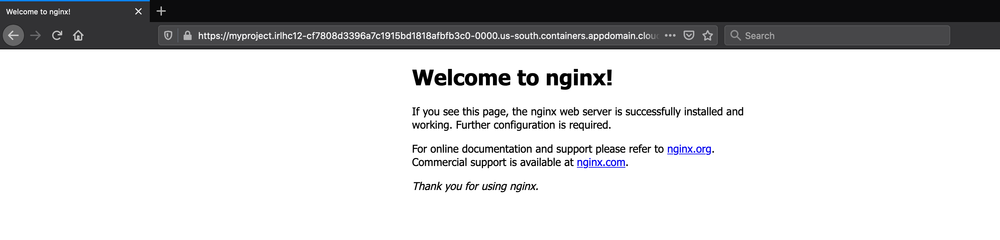

# Migrating and deploying Docker compose/swarm applications to Kubernetes

## Description

This document explains steps that will install move2kube and translate docker-compose artifacts. Let's try to take a Docker compose file and deploy it to Kubernetes. We will be using the `single-service` data from [samples/docker-compose](https://github.com/konveyor/move2kube-demos/tree/main/samples/docker-compose).

## Prerequisites

1. Install Move2Kube.

   ```console
   $ bash <(curl https://raw.githubusercontent.com/konveyor/move2kube/main/scripts/install.sh)
   ```

2. Install dependencies.
  * [Docker](https://www.docker.com/get-started)
  * [operator-sdk](https://docs.openshift.com/container-platform/4.1/applications/operator_sdk/osdk-getting-started.html#osdk-installing-cli_osdk-getting-started)
  * [kubectl](https://kubernetes.io/docs/tasks/tools/install-kubectl/)
  * [Pack](https://buildpacks.io/docs/tools/pack/)

   For convenience, we have provided a script which can help you to install all these dependencies in one go.

   ```console
   $ bash <(curl https://raw.githubusercontent.com/konveyor/move2kube/main/scripts/installdeps.sh)
   ```
   To verify that dependencies were correctly installed
   ```console
   $ operator-sdk version
   ```
   ```console
   $ docker version
   ```
   ```console
   $ pack version
   ```
   ```console
   $ kubectl version
   ```
3. Install [Helm v3](https://helm.sh/docs/intro/install/)

   To verify that Helm v3 was correctly installed
   ```console
   $ helm version
   ```

4. Clone the [move2kube-demos](https://github.com/konveyor/move2kube-demos) repository

   ```console
   $ git clone https://github.com/konveyor/move2kube-demos.git
   ```

   ```console
   $ cd move2kube-demos
   ```
   Let's see the structure inside the `samples/docker-compose/single-service` directory.

   ```console
   move2kube-demos git:(main) $ tree samples/docker-compose/single-service
   samples/docker-compose/single-service
   └── docker-compose.yaml
   ```

   Here we have a single docker-compose file inside the source directory, but the it could have multiple docker-compose files also. Move2Kube has the capability to go through all the docker-compose files and combine them and give a holistic view for you.

## Steps to generate target artifacts

<span>1.</span> Execute `move2kube translate -s samples/docker-compose/single-service`.

```console

move2kube-demos git:(main) $ move2kube translate -s samples/docker-compose/single-service
INFO[0000] Planning Translation                         
INFO[0000] [*source.DockerfileTranslator] Planning translation
INFO[0000] [*source.DockerfileTranslator] Done          
INFO[0000] [*source.ComposeTranslator] Planning translation
INFO[0000] [*source.ComposeTranslator] Done             
INFO[0000] [*source.CfManifestTranslator] Planning translation
INFO[0000] [*source.CfManifestTranslator] Done          
INFO[0000] [*source.KnativeTranslator] Planning translation
INFO[0000] [*source.KnativeTranslator] Done             
INFO[0000] [*source.KubeTranslator] Planning translation
INFO[0000] [*source.KubeTranslator] Done                
INFO[0000] [*source.Any2KubeTranslator] Planning translation
INFO[0003] [*source.Any2KubeTranslator] Done            
INFO[0003] Translation planning done                    
INFO[0003] Planning Metadata                            
INFO[0003] [*metadata.ClusterMDLoader] Planning metadata
INFO[0003] [*metadata.ClusterMDLoader] Done             
INFO[0003] [*metadata.K8sFilesLoader] Planning metadata
INFO[0003] [*metadata.K8sFilesLoader] Done              
INFO[0003] [*metadata.QACacheLoader] Planning metadata  
INFO[0003] [*metadata.QACacheLoader] Done               
INFO[0003] Metadata planning done
```

* It goes through each and every file and tries to analyze and understand each one of them. Then it tries to interact with you whenever it has a doubt. It creates the *plan* for you internally and then will come back to you when it has some doubts.

```console
? 1. Select all services that are needed:
Hints:
 [The services unselected here will be ignored.]
  [Use arrows to move, space to select, <right> to all, <left> to none, type to filter]
> [✓]  web
```

* Here, we go ahead with the web service.

```console
? 2. Select all containerization modes that is of interest:
Hints:
 [The services which does not support any of the containerization technique you are interested will be ignored.]
  [Use arrows to move, space to select, <right> to all, <left> to none, type to filter]
> [✓]  Reuse
```

* Do you want to reuse the container images? Here, we go ahead with the default which is to reuse.

```console
? 3. Choose the artifact type:
Hints:
 [Yamls - Generate Kubernetes Yamls Helm - Generate Helm chart Knative - Create Knative artifacts]
  [Use arrows to move, type to filter]
> Yamls
  Helm
  Knative
```

* Whether you want Helm charts, Yamls or Knative artifacts? Let's go ahead with Yamls.

```console
? 4. Choose the cluster type:
Hints:
 [Choose the cluster type you would like to target]
  [Use arrows to move, type to filter]
  AWS-EKS
  Azure-AKS
  GCP-GKE
  IBM-IKS
  IBM-Openshift
> Kubernetes
  Openshift
```

* Now, it asks to select the cluster type you want to deploy to. We will deploy to Kubernetes cluster.

```console
? 5. Select all services that should be exposed:
Hints:
 [The services unselected here will not be exposed.]
  [Use arrows to move, space to select, <right> to all, <left> to none, type to filter]
> [✓]  web

INFO[1303] Optimization done                            
INFO[1303] Begin Customization
```

* Select the services which needs to be exposed. We want to expose the web service.

```console
? 6. [] What type of container registry login do you want to use?
Hints:
 [Docker login from config mode, will use the default config from your local machine.]
  [Use arrows to move, type to filter]
> Use existing pull secret
  No authentication
  UserName/Password
```

* Now it asks about the type of container registry login.

```console
? 7. [] Enter the name of the pull secret :  
Hints:
 [The pull secret should exist in the namespace where you will be deploying the application.]
 all-icr-io
```

* Then, it asks about the name of the pull secret.

```console
? 8. Provide the ingress host domain
Hints:
 [Ingress host domain is part of service URL]
 (myproject.com) irlhc12-cf7808d3396a7c1915bd1818afbfb3c0-0000.us-south.containers.appdomain.cloud
```

* It is now asking for the ingress hosting domain. It can be grabbed for the cluster you are going to deploy to. In case of IBM Cloud Container Service, this is what we are copying from our Kubernetes cluster as shown below, and the ingress hosting domain will differ based on the cluster you are fetching from.


```console
? 9. Provide the TLS secret for ingress
 Hints:
  [Enter TLS secret name]


INFO[1369] Customization done                           
INFO[1369] Execution completed                          
INFO[1369] Translated target artifacts can be found at [myproject].   
```
Now we will go ahead with the default for the TLS secret (by pressing the return key).

Finally, the translation is successful and the target artifacts can be found inside the *myproject* folder. The structure of the *myproject* folder can be seen by executing the below command.

```console
move2kube-demos git:(main) $ tree myproject
myproject
├── NOTES.txt
├── Readme.md
├── containers
├── deploy.sh
├── docker-compose.yaml
├── m2kqacache.yaml
└── myproject
    ├── web-deployment.yaml
    ├── web-ingress.yaml
    └── web-service.yaml
```

Since this is a pre-containerized environment, container files are already there and only the Kubernetes artifacts are created. Move2Kube has created deployment artifact, service yaml and ingress for the web service. So, this is a quick way where you can take your docker-compose file and within few seconds you can have all your Kubernetes artifacts required to deploy to your cluster.

## Deploying the application to Kubernetes with the generated target artifacts

1. Let's get inside the *myproject* directory.

   ```console
   move2kube-demos git:(main) $ cd myproject/
   ```

   ```console
   myproject git:(main) $ ls
   NOTES.txt           Readme.md           containers          deploy.sh           docker-compose.yaml m2kqacache.yaml     myproject
   ```

   `Readme.md` has the instructions about the deployment.

   ```console
   myproject git:(main) $ cat Readme.md
   Move2Kube
   ---------
   Congratulations! Move2Kube has generated the necessary build artfiacts for moving all your application components to Kubernetes. Using the artifacts in this directory you can deploy your application in a kubernetes cluster.

   Prerequisites
   -------------
   * Docker
   * Helm
   * Kubectl
   * Source-To-Image (S2I) https://github.com/openshift/source-to-image

   Next Steps
   ----------
   * Use "deploy.sh" to deploy your artifacts into a kubernetes cluster.
   ```

2. Now we will deploy the artifact to our Kubernetes cluster using the `deploy.sh`.

   ```console
   myproject git:(main) $ ./deploy.sh
   deployment.apps/web configured
   ingress.networking.k8s.io/web configured
   service/web configured

   The services are accessible on the following paths:
   web : http://myproject.irlhc12-cf7808d3396a7c1915bd1818afbfb3c0-0000.us-south.containers.appdomain.cloud/web
   ```

   * web service is accesible on the path- `http://myproject.irlhc12-cf7808d3396a7c1915bd1818afbfb3c0-0000.us-south.containers.appdomain.cloud/web`

   
