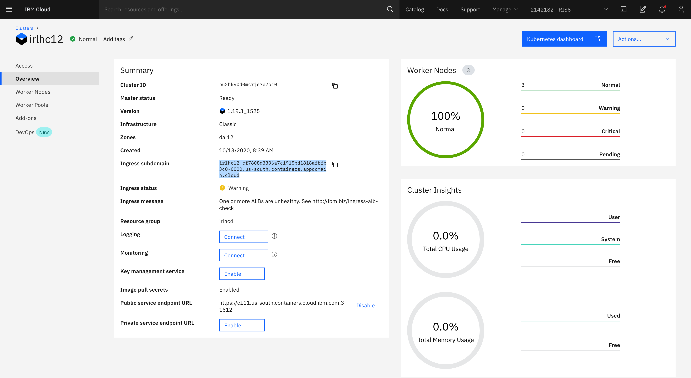
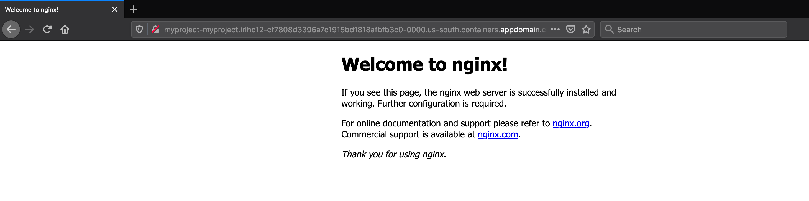
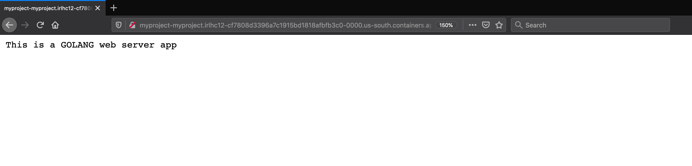
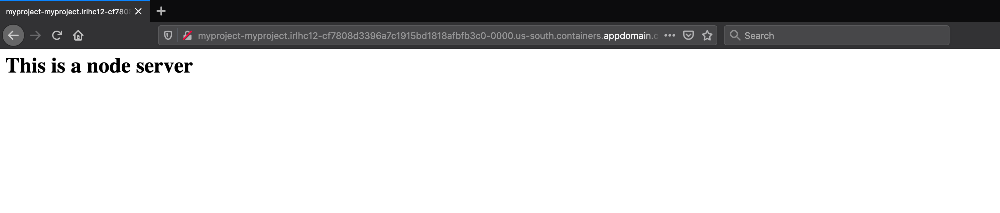

# Migrating and deploying Golang and Node.js apps to Kubernetes

## Description

This document explains the steps that will install Move2Kube and also tells how to use Move2Kube to containerize and create deployment artifacts. We will be using the data from [samples/e2e-flow](https://github.com/konveyor/move2kube-demos/tree/main/samples/e2e-flow) which has two applications, one golang appication and one nodejs application. These applications can be Cloud Foundry applications or they can be normal applications deployed to VMs.

Now, let's see how these applications can be translated to Kubernetes. Here we are going to use the one step process for this sample usecase.

## Prerequisites

1. Install Move2Kube.

   ```console
   $ bash <(curl https://raw.githubusercontent.com/konveyor/move2kube/master/scripts/install.sh)
   ```

2. Install dependencies.
  * [Docker](https://www.docker.com/get-started)
  * [operator-sdk](https://docs.openshift.com/container-platform/4.1/applications/operator_sdk/osdk-getting-started.html#osdk-installing-cli_osdk-getting-started)
  * [kubectl](https://kubernetes.io/docs/tasks/tools/install-kubectl/)
  * [Pack](https://buildpacks.io/docs/tools/pack/)

   For convenience, we have provided a script which can help you to install all these dependencies in one go.

   ```console
   $ bash <(curl https://raw.githubusercontent.com/konveyor/move2kube/master/scripts/installdeps.sh)
   ```
   To verify that dependencies were correctly installed
   ```console
   $ operator-sdk version
   ```
   ```console
   $ docker version
   ```
   ```console
   $ pack version
   ```
   ```console
   $ kubectl version
   ```
3. Install [Helm v3](https://helm.sh/docs/intro/install/)

   To verify that Helm v3 was correctly installed
   ```console
   $ helm version
   ```

4. Clone the [move2kube-demos](https://github.com/konveyor/move2kube-demos) repository

   ```console
   $ git clone https://github.com/konveyor/move2kube-demos.git
   ```

   ```console
   $ cd move2kube-demos
   ```
   Let's see the structure inside the `samples/e2e-flow` directory.

   ```console
   move2kube-demos git:(main) $ tree samples/e2e-flow
   samples/e2e-flow
   ├── golang
   │   └── main.go
   └── nodejs
       ├── main.js
       └── package.json
   ```

## Steps to generate target artifacts

<span>1.</span> Execute `move2kube translate -s samples/e2e-flow`.

```console
move2kube-demos git:(main) $ move2kube translate -s samples/e2e-flow
INFO[0000] Planning Translation                         
INFO[0000] [*source.DockerfileTranslator] Planning translation
INFO[0000] [*source.DockerfileTranslator] Done          
INFO[0000] [*source.ComposeTranslator] Planning translation
INFO[0000] [*source.ComposeTranslator] Done             
INFO[0000] [*source.CfManifestTranslator] Planning translation
INFO[0000] [*source.CfManifestTranslator] Done          
INFO[0000] [*source.KnativeTranslator] Planning translation
INFO[0000] [*source.KnativeTranslator] Done             
INFO[0000] [*source.KubeTranslator] Planning translation
INFO[0000] [*source.KubeTranslator] Done                
INFO[0000] [*source.Any2KubeTranslator] Planning translation
INFO[0006] [*source.Any2KubeTranslator] Done            
INFO[0006] Translation planning done                    
INFO[0006] Planning Metadata                            
INFO[0006] [*metadata.ClusterMDLoader] Planning metadata
INFO[0006] [*metadata.ClusterMDLoader] Done             
INFO[0006] [*metadata.K8sFilesLoader] Planning metadata
INFO[0006] [*metadata.K8sFilesLoader] Done              
INFO[0006] [*metadata.QACacheLoader] Planning metadata  
INFO[0006] [*metadata.QACacheLoader] Done               
INFO[0006] Metadata planning done
```

* It goes through each and every file and tries to analyze and understand each one of them. Then it tries to interact with you whenever it has a doubt. It creates the *plan* for you internally and then will come back to you when it has some doubts.

```console
? 1. Select all services that are needed:
Hints:
 [The services unselected here will be ignored.]
  [Use arrows to move, space to select, <right> to all, <left> to none, type to filter]
> [✓]  golang
  [✓]  nodejs
```

* It has identified two services (golang and nodejs), and is asking if you want to translate all of them.

```console
? 2. Select all containerization modes that is of interest:
Hints:
 [The services which does not support any of the containerization technique you are interested will be ignored.]
  [Use arrows to move, space to select, <right> to all, <left> to none, type to filter]
> [✓]  NewDockerfile
  [ ]  S2I
  [ ]  CNB
```

* In both the services, Move2Kube can translate using multiple containerization techniques. It might be Dockerfile, S2I (Source-To-Image) or CNB (Cloud Native Buildpack). Let's just go with the Dockerfile.

```console
? 3. Choose the artifact type:
Hints:
 [Yamls - Generate Kubernetes Yamls Helm - Generate Helm chart Knative - Create Knative artifacts]
  [Use arrows to move, type to filter]
  Yamls
> Helm
  Knative
```

* Now it asks, what do you want to create - Yaml files, Helm charts or Knative artifacts? Let's go with the Helm.

```console
? 4. Choose the cluster type:
Hints:
 [Choose the cluster type you would like to target]
  [Use arrows to move, type to filter]
  Openshift
  AWS-EKS
  Azure-AKS
  GCP-GKE
  IBM-IKS
  IBM-Openshift
> Kubernetes
```

* What kind of clustering you are going to deploy to (OpenShift or Kubernetes or particular flavors of Kubernetes)? Here we select Kubernetes.

```console
? 5. Select all services that should be exposed:
Hints:
 [The services unselected here will not be exposed.]
  [Use arrows to move, space to select, <right> to all, <left> to none, type to filter]
> [✓]  golang
  [✓]  nodejs
```

* What are the services that you want to expose externally? Going with the by-default (all of them).

```console
? 6. Select the registry where your images are hosted:
Hints:
 [You can always change it later by changing the yamls.]
  [Use arrows to move, type to filter]
> Other
  index.docker.io
  docker.io
```
* Then it asks to select the registry where your images are hosted. Select 'Other' if your registry name is not here.

```console
? 7. Enter the name of the registry :  
Hints:
 [Ex : docker.io]
 (docker.io) us.icr.io
 ```

* Enter the name of the registry where you host the images. Here we enter `us.icr.io` registry name.

```console
? 8. Enter the namespace where the new images are pushed :  
Hints:
 [Ex : myproject]
 (myproject) m2kdemo
 ```
* Input the namespace under which you want to deploy- m2kdemo.

```console
? 9. [us.icr.io] What type of container registry login do you want to use?
Hints:
 [Docker login from config mode, will use the default config from your local machine.]
  [Use arrows to move, type to filter]
> Use existing pull secret
  No authentication
  UserName/Password
```
* Now it asks about the type of container registry login.

```console
? 10. [us.icr.io] Enter the name of the pull secret :  
Hints:
 [The pull secret should exist in the namespace where you will be deploying the application.]
 all-icr-io
```

* Then, it asks about the name of the pull secret.

```console
? 11. Provide the ingress host domain
Hints:
 [Ingress host domain is part of service URL]
 (myproject.com) irlhc12-cf7808d3396a7c1915bd1818afbfb3c0-0000.us-south.containers.appdomain.cloud
```

* It is now asking for the ingress hosting domain. It can be grabbed for the cluster you are going to deploy to. In case of IBM Cloud Container Service, this is what we are copying from our Kubernetes cluster as shown below, and the ingress hosting domain will differ based on the cluster you are fetching from.



```console
? 12. Provide the TLS secret for ingress
Hints:
 [Enter TLS secret name]

INFO[0952] Customization done                           
INFO[0952] Begin Parameterization                       
INFO[0952] Parameterization done
```

* Then it asks information about your TLS secret. By-default if no secret is provided, it will create and 'http' ingress endpoint. Else if the secret is provided, it will create and 'https' endpoint. Here we go with the by-default by pressing the 'return' key.

```console
? 13. The CI/CD pipeline needs access to the git repos in order to clone, build and push. If any of the repos require ssh keys you will need to provide them. Do you want to load the private ssh keys from [/Users/akash/.ssh]?:
Hints:
 [No, I will add them later if necessary.]
 (y/N) N
```

* Going with defaults for the CI/CD pipeline.

```console
INFO[1235] Execution completed                          
INFO[1235] Translated target artifacts can be found at [myproject].
```

Finally, the translation is successful and the target artifacts can be found inside the *myproject* folder. The structure of the *myproject* folder can be seen by executing the below command.

```console
move2kube-demos git:(main) $ tree myproject
myproject
├── Readme.md
├── buildimages.sh
├── cicd
│   ├── myproject-clone-build-push-pipeline.yaml
│   ├── myproject-clone-push-serviceaccount.yaml
│   ├── myproject-git-event-triggerbinding.yaml
│   ├── myproject-git-repo-eventlistener.yaml
│   ├── myproject-git-repo-github-com-secret.yaml
│   ├── myproject-git-repo-ingress.yaml
│   ├── myproject-image-registry-secret.yaml
│   ├── myproject-run-clone-build-push-triggertemplate.yaml
│   ├── myproject-tekton-triggers-admin-role.yaml
│   ├── myproject-tekton-triggers-admin-rolebinding.yaml
│   └── myproject-tekton-triggers-admin-serviceaccount.yaml
├── containers
│   ├── golang
│   │   ├── Dockerfile.golang
│   │   └── golangdockerbuild.sh
│   └── nodejs
│       ├── Dockerfile.nodejs
│       └── nodejsdockerbuild.sh
├── copysources.sh
├── docker-compose.yaml
├── helminstall.sh
├── m2kqacache.yaml
├── myproject
│   ├── Chart.yaml
│   ├── README.md
│   ├── templates
│   │   ├── NOTES.txt
│   │   ├── golang-deployment.yaml
│   │   ├── golang-service.yaml
│   │   ├── myproject-ingress.yaml
│   │   ├── nodejs-deployment.yaml
│   │   └── nodejs-service.yaml
│   └── values.yaml
├── myproject-operator
│   ├── Dockerfile
│   ├── Makefile
│   ├── PROJECT
│   ├── config
│   │   ├── crd
│   │   │   ├── bases
│   │   │   │   └── myproject.io_myprojects.yaml
│   │   │   └── kustomization.yaml
│   │   ├── default
│   │   │   ├── kustomization.yaml
│   │   │   └── manager_auth_proxy_patch.yaml
│   │   ├── manager
│   │   │   ├── kustomization.yaml
│   │   │   └── manager.yaml
│   │   ├── prometheus
│   │   │   ├── kustomization.yaml
│   │   │   └── monitor.yaml
│   │   ├── rbac
│   │   │   ├── auth_proxy_client_clusterrole.yaml
│   │   │   ├── auth_proxy_role.yaml
│   │   │   ├── auth_proxy_role_binding.yaml
│   │   │   ├── auth_proxy_service.yaml
│   │   │   ├── kustomization.yaml
│   │   │   ├── leader_election_role.yaml
│   │   │   ├── leader_election_role_binding.yaml
│   │   │   ├── myproject_editor_role.yaml
│   │   │   ├── myproject_viewer_role.yaml
│   │   │   ├── role.yaml
│   │   │   └── role_binding.yaml
│   │   ├── samples
│   │   │   ├── kustomization.yaml
│   │   │   └── myproject_v1alpha1_myproject.yaml
│   │   └── scorecard
│   │       ├── bases
│   │       │   └── config.yaml
│   │       ├── kustomization.yaml
│   │       └── patches
│   │           ├── basic.config.yaml
│   │           └── olm.config.yaml
│   ├── helm-charts
│   │   └── myproject
│   │       ├── Chart.yaml
│   │       ├── README.md
│   │       ├── templates
│   │       │   ├── NOTES.txt
│   │       │   ├── golang-deployment.yaml
│   │       │   ├── golang-service.yaml
│   │       │   ├── myproject-ingress.yaml
│   │       │   ├── nodejs-deployment.yaml
│   │       │   └── nodejs-service.yaml
│   │       └── values.yaml
│   └── watches.yaml
└── pushimages.sh

21 directories, 69 files
```

The created Helm charts are stored inside the *myproject/myproject* directory. The Readme.md file guides on the next steps to be followed. Many scripts like buildimages.sh, copysources.sh, helminstall.sh and docker-compose.yaml are also present inside the *myproject* folder. Move2Kube also created a Helm-based operator for you inside the *myproject/myproject-operator*. A CI/CD pipeline is also created for you and it uses the containerization scripts inside the *myproject/cicd/containers* directory.

Now, the next step will be to deploy the applications using the created target artifacts.


## Deploying the application to Kubernetes with the generated target artifacts

1. Let's get inside the *myproject* directory.

   ```console
   move2kube-demos git:(main) $ cd myproject/
   ```

   ```console
   myproject git:(main) $ ls
   Readme.md           cicd                copysources.sh      helminstall.sh      myproject           pushimages.sh
   buildimages.sh      containers          docker-compose.yaml m2kqacache.yaml     myproject-operator
   ```

2. We will now run the *copysources.sh* script and provide it the path to the folder containing the source artifacts.

   ```console
   myproject git:(main) $ ./copysources.sh ../samples/e2e-flow/
   ```

3. Next we run the *buildimages.sh* script.

   ```console
   myproject git:(main) $ ./buildimages.sh
   ```

4. Now using the *pushimages.sh* script we can push our applications images to the registry `us.icr.io/m2kdemos/golang` and `us.icr.io/m2kdemo/nodejs` that we specified during the *translate* phase. For this step, you are required to log in to the Docker registry. To log in to IBM Cloud `us.icr.io` registry refer [here](https://cloud.ibm.com/docs/Registry?topic=Registry-registry_access#registry_access_apikey_auth_docker).

   ```console
   myproject git:(main) $ ./pushimages.sh
   The push refers to repository [us.icr.io/m2kdemo/nodejs]
   4157ab4a11fe: Pushed
   058a9d750e97: Pushed
   8e38d704f1b8: Layer already exists
   ffdb6cc9bdbb: Layer already exists
   511ade7a7dff: Layer already exists
   b7b591e3443f: Layer already exists
   ccf04fbd6e19: Layer already exists
   latest: digest: sha256:c17dcdda93894de50ea5a7369aefd9638aa52ee8a6b19605f9ab6f0aa7cc669c size: 1790
   The push refers to repository [us.icr.io/m2kdemo/golang]
   6e1a12527c37: Pushed
   b7b591e3443f: Layer already exists
   ccf04fbd6e19: Layer already exists
   latest: digest: sha256:20a078df49b233be0439e1a335f36467cf3df6d3695447d054e92a02d8f07e9e size: 948
   ```

5. Since we have created the Helm chart, in the next step we are going to install it using the *helminstall.sh* script.

   ```console
   myproject git:(main) $ ./helminstall.sh
   Release "myproject" does not exist. Installing it now.
   NAME: myproject
   LAST DEPLOYED: Tue Nov  3 15:12:17 2020
   NAMESPACE: default
   STATUS: deployed
   REVISION: 1
   TEST SUITE: None
   NOTES:
   Thank you for installing myproject. Your release is named myproject.

   Your services are exposed in ingress at myproject-myproject.irlhc12-cf7808d3396a7c1915bd1818afbfb3c0-0000.us-south.containers.appdomain.cloud.

   To learn more about the release, try:
     $ helm status myproject
     $ helm get all myproject
   ```

Now, both our applications have been exposed in the form of ingress and the base ingress is `myproject-myproject.irlhc12-cf7808d3396a7c1915bd1818afbfb3c0-0000.us-south.containers.appdomain.cloud`.



Since, we did not give the TLS secret during the question-answering, so we need to go to the 'http' endpoints of the applications. If you had given the TLS secret, then the https endpoints will also be working.

   * golang application endpoint- `http://myproject-myproject.irlhc12-cf7808d3396a7c1915bd1818afbfb3c0-0000.us-south.containers.appdomain.cloud/golang`

   

   * nodejs application endpoint- `http://myproject-myproject.irlhc12-cf7808d3396a7c1915bd1818afbfb3c0-0000.us-south.containers.appdomain.cloud/nodejs`

   
