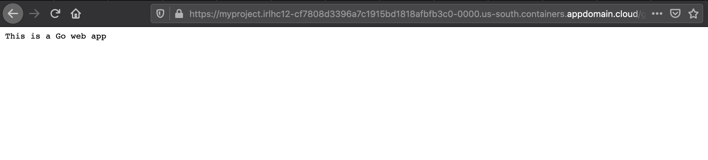
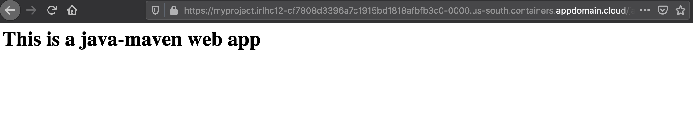
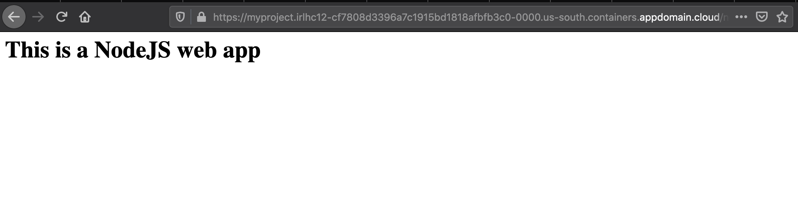
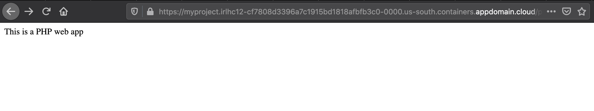
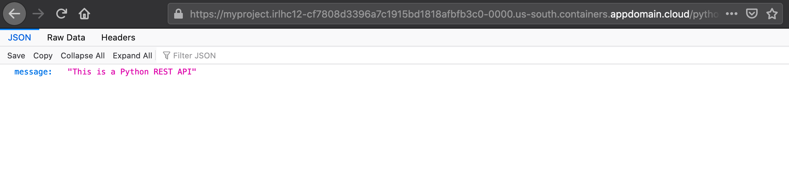
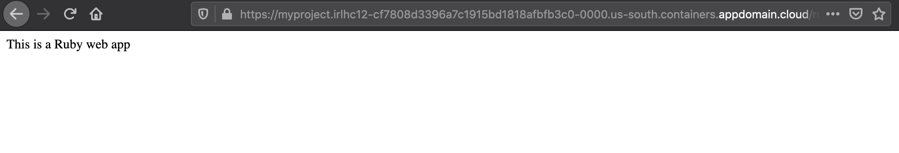

# Migrating and deploying VM applications to Kubernetes

## Description

This document explains the steps that will install Move2Kube and also tells how to use Move2Kube's 2 step process to containerize and create deployment artifacts. In this tutorial, we will be using the data from [samples/language-platforms](https://github.com/konveyor/move2kube-demos/tree/main/samples/language-platforms). Language-platforms sample is a combination of multiple applications in different languages (Java, Go, Python, Ruby, etc.) which needs to be containerized and then put into Kubernetes. These applications can be Cloud Foundry applications or they can be normal applications deployed to VMs.

Now, let's see how these applications can be translated to Kubernetes.

## Prerequisites

1. Install Move2Kube.

   ```console
   $ bash <(curl https://raw.githubusercontent.com/konveyor/move2kube/master/scripts/install.sh)
   ```

2. Install dependencies.
  * [Docker](https://www.docker.com/get-started)
  * [operator-sdk](https://docs.openshift.com/container-platform/4.1/applications/operator_sdk/osdk-getting-started.html#osdk-installing-cli_osdk-getting-started)
  * [kubectl](https://kubernetes.io/docs/tasks/tools/install-kubectl/)
  * [Pack](https://buildpacks.io/docs/tools/pack/)

   For convenience, we have provided a script which can help you to install all these dependencies in one go.

   ```console
   $ bash <(curl https://raw.githubusercontent.com/konveyor/move2kube/master/scripts/installdeps.sh)
   ```
   To verify that dependencies were correctly installed
   ```console
   $ operator-sdk version
   ```
   ```console
   $ docker version
   ```
   ```console
   $ pack version
   ```
   ```console
   $ kubectl version
   ```
3. Install [S2I (Source-To-Image)](https://github.com/openshift/source-to-image#installation)

4. Clone the [move2kube-demos](https://github.com/konveyor/move2kube-demos) repository

   ```console
   $ git clone https://github.com/konveyor/move2kube-demos.git
   ```

   ```console
   $ cd move2kube-demos
   ```
   Now, let's see the structure inside the `samples/language-platforms` directory.

    ```console
    move2kube-demos git:(main) $ tree samples/language-platforms
    samples/language-platforms
    ├── custom-java-gradle-containerizer
    │   ├── Dockerfile
    │   └── m2kdfdetect.sh
    ├── golang
    │   └── main.go
    ├── java-gradle
    │   ├── build.gradle
    │   └── src
    │       └── main
    │           ├── java
    │           │   └── simplewebapp
    │           │       └── MainServlet.java
    │           └── webapp
    │               └── WEB-INF
    │                   └── web.xml
    ├── java-gradle-war
    │   └── java-gradle-war.war
    ├── java-maven
    │   ├── pom.xml
    │   └── src
    │       └── main
    │           └── webapp
    │               ├── WEB-INF
    │               │   └── web.xml
    │               └── index.jsp
    ├── java-maven-war
    │   └── java-maven-war.war
    ├── nodejs
    │   ├── main.js
    │   └── package.json
    ├── php
    │   └── php
    │       └── index.php
    ├── python
    │   ├── main.py
    │   └── requirements.txt
    └── ruby
        ├── Gemfile
        ├── app.rb
        ├── config.ru
        └── views
            └── main.erb
    ```

## Steps to generate target artifacts

Here we are going to use the two step process for this sample usecase.

<span>1.</span> Execute `move2kube plan -s samples/language-platforms`. It will go through each and every files and combine them, trying to make sense out of them. And then it will come up with a *plan* file for you which you can then curate.

```console
move2kube-demos git:(main) $ move2kube plan -s samples/language-platforms
INFO[0000] Planning Translation                         
INFO[0000] [*source.DockerfileTranslator] Planning translation
INFO[0000] [*source.DockerfileTranslator] Done          
INFO[0000] [*source.ComposeTranslator] Planning translation
INFO[0000] [*source.ComposeTranslator] Done             
INFO[0000] [*source.CfManifestTranslator] Planning translation
INFO[0000] [*source.CfManifestTranslator] Done          
INFO[0000] [*source.KnativeTranslator] Planning translation
INFO[0000] [*source.KnativeTranslator] Done             
INFO[0000] [*source.KubeTranslator] Planning translation
INFO[0000] [*source.KubeTranslator] Done                
INFO[0000] [*source.Any2KubeTranslator] Planning translation
INFO[0019] [*source.Any2KubeTranslator] Done            
INFO[0019] Translation planning done                    
INFO[0019] Planning Metadata                            
INFO[0019] [*metadata.ClusterMDLoader] Planning metadata
INFO[0020] [*metadata.ClusterMDLoader] Done             
INFO[0020] [*metadata.K8sFilesLoader] Planning metadata
INFO[0020] [*metadata.K8sFilesLoader] Done              
INFO[0020] [*metadata.QACacheLoader] Planning metadata  
INFO[0020] [*metadata.QACacheLoader] Done               
INFO[0020] Metadata planning done                       
INFO[0020] Plan can be found at [/Users/go/src/move2kube-demos/m2k.plan].
```

* It has created a *m2k.plan* which is essentially a yaml file. It has multitudes of options about the different services and the different information it has collected. It also includes the different ways in which the applications can be containerized.

<span>2.</span> Now, we are going to use the `move2kube translate -c` for the containerization process. This will take us through the curation of the created *plan*.

```console
move2kube-demos git:(main) $ move2kube translate -c

INFO[0000] Detected a plan file in /Users/go/src/move2kube-demos/m2k.plan. Will translate using this plan.
? 1. Select all services that are needed:
Hints:
 [The services unselected here will be ignored.]
  [Use arrows to move, space to select, <right> to all, <left> to none, type to filter]
> [✓]  php
  [✓]  golang
  [✓]  java-gradle
  [✓]  java-maven
  [✓]  nodejs
  [✓]  python
  [✓]  ruby
```

* It has identified seven services, and is asking you to select the services which you want to get translated. We select all the services here.

```console
? 2. Select all containerization modes that is of interest:
Hints:
 [The services which does not support any of the containerization technique you are interested will be ignored.]
  [Use arrows to move, space to select, <right> to all, <left> to none, type to filter]
> [ ]  ReuseDockerfile
  [ ]  NewDockerfile
  [✓]  S2I
  [ ]  CNB
```

* For all the services, Move2Kube can translate them using multiple containerization techniques. It might be Dockerfile, S2I (Source-To-Image) or CNB (Cloud Native Buildpack). Let's just go with the S2I.

```console
? 3. Choose the artifact type:
Hints:
 [Yamls - Generate Kubernetes Yamls Helm - Generate Helm chart Knative - Create Knative artifacts]
  [Use arrows to move, type to filter]
> Yamls
  Helm
  Knative
```

* Now it asks, what do you want to create - Yaml files, Helm charts or Knative artifacts? Let's go ahead with the Yamls.

```console
? 4. Choose the cluster type:
Hints:
 [Choose the cluster type you would like to target]
  [Use arrows to move, type to filter]
  IBM-Openshift
> Kubernetes
  Openshift
  AWS-EKS
  Azure-AKS
  GCP-GKE
  IBM-IKS
```

* What kind of clustering you are going to deploy to (OpenShift or Kubernetes or particular flavors of Kubernetes)? Here we select Kubernetes.

```console
? 5. Select all services that should be exposed:
Hints:
 [The services unselected here will not be exposed.]
  [Use arrows to move, space to select, <right> to all, <left> to none, type to filter]
> [✓]  golang
  [✓]  java-maven
  [✓]  nodejs
  [✓]  php
  [✓]  python
  [✓]  ruby
```

* What are the services that you want to expose externally? We selected all of them.

```console
? 6. Select the registry where your images are hosted:
Hints:
 [You can always change it later by changing the yamls.]
  [Use arrows to move, type to filter]
  Other
  index.docker.io
> us.icr.io
  docker.io
```

* Then it asks to select the registry where your images are hosted. Select 'Other' if your registry name is not here.

```console
? 7. Enter the namespace where the new images are pushed :  
Hints:
 [Ex : myproject]
 (myproject) m2k-tutorial
```

* Input the namespace under which you want to deploy- m2-tutorial.

```console
? 8. [us.icr.io] What type of container registry login do you want to use?
Hints:
 [Docker login from config mode, will use the default config from your local machine.]
  [Use arrows to move, type to filter]
> Use existing pull secret
  No authentication
  UserName/Password
```

* Now it asks about the type of container registry login.

```console
? 9. [us.icr.io] Enter the name of the pull secret :  
Hints:
 [The pull secret should exist in the namespace where you will be deploying the application.]
 all-icr-io
```

* Then, it asks about the name of the pull secret.

```console
? 10. Provide the ingress host domain
Hints:
 [Ingress host domain is part of service URL]
 (myproject.com) irlhc12-cf7808d3396a7c1915bd1818afbfb3c0-0000.us-south.containers.appdomain.cloud
```

* It is now asking for the ingress hosting domain. It can be grabbed for the cluster you are going to deploy to. In case of IBM Cloud Container Service, this is what we are copying from our Kubernetes cluster as shown below, and the ingress hosting domain will differ based on the cluster you are fetching from.


```console
? 11. Provide the TLS secret for ingress
Hints:
 [Enter TLS secret name]
```

* Then it asks information about your TLS secret. Here we go with the by-default by pressing the 'return' key.

```console
? 12. The CI/CD pipeline needs access to the git repos in order to clone, build and push.
Move2Kube has public keys for github.com, gitlab.com, and bitbucket.org by default.
If any of the repos use ssh authentication we will need public keys in order to verify.
Do you want to load the public keys from your [/Users/akash/.ssh/known_hosts]?:
Hints:
 [No, I will add them later if necessary.]
 (y/N)

 13. The CI/CD pipeline needs access to the git repos in order to clone, build and push.
If any of the repos require ssh keys you will need to provide them.
Do you want to load the private ssh keys from []?:
Hints:
 [No, I will add them later if necessary.]

```

* Going with defaults for the CI/CD pipeline by again pressing the 'return' key.

```console
INFO[1196] Execution completed                          
INFO[1196] Translated target artifacts can be found at [myproject].
```

Finally, the translation is successful and the target artifacts can be found inside the *myproject* folder. The structure of the *myproject* folder can be seen by executing the below command.

```console
move2kube-demos git:(main) $ tree myproject
myproject
├── NOTES.txt
├── Readme.md
├── buildimages.sh
├── cicd
│   ├── myproject-clone-build-push-pipeline.yaml
│   ├── myproject-clone-push-serviceaccount.yaml
│   ├── myproject-git-event-triggerbinding.yaml
│   ├── myproject-git-repo-eventlistener.yaml
│   ├── myproject-git-repo-github-com-secret.yaml
│   ├── myproject-git-repo-ingress.yaml
│   ├── myproject-image-registry-secret.yaml
│   ├── myproject-run-clone-build-push-triggertemplate.yaml
│   ├── myproject-tekton-triggers-admin-role.yaml
│   ├── myproject-tekton-triggers-admin-rolebinding.yaml
│   └── myproject-tekton-triggers-admin-serviceaccount.yaml
├── containers
│   ├── golang
│   │   └── golang-s2i-build.sh
│   ├── java-maven
│   │   └── java-maven-s2i-build.sh
│   ├── nodejs
│   │   └── nodejs-s2i-build.sh
│   ├── php
│   │   └── php-s2i-build.sh
│   ├── python
│   │   └── python-s2i-build.sh
│   └── ruby
│       └── ruby-s2i-build.sh
├── copysources.sh
├── deploy.sh
├── docker-compose.yaml
├── m2kqacache.yaml
├── myproject
│   ├── golang-deployment.yaml
│   ├── golang-service.yaml
│   ├── java-maven-deployment.yaml
│   ├── java-maven-service.yaml
│   ├── myproject-ingress.yaml
│   ├── nodejs-deployment.yaml
│   ├── nodejs-service.yaml
│   ├── php-deployment.yaml
│   ├── php-service.yaml
│   ├── python-deployment.yaml
│   ├── python-service.yaml
│   ├── ruby-deployment.yaml
│   └── ruby-service.yaml
└── pushimages.sh
```

It has created Yamls for us which are stored inside the *myproject/myproject* directory. For each of the folders and the services identified, it has created the deployment artifacts, service artifacts and the ingress as required. The *Readme.md* file guides on the next steps to be followed. The *containers* folder contains the scripts for building the images for the applications using S2I.

Many scripts like *buildimages.sh*, *copysources.sh* and *deploy.sh* are also present inside the *myproject* folder. It has also created a simple *docker-compose.yaml* for you, so that you can test the images locally if you want. It has also created Tekton artifacts inside the *cicd* directory that are required if you want to use Tekton as your CI/CD pipeline.

## Deploying the application to Kubernetes with the generated target artifacts

1. Let's get inside the *myproject* directory.

   ```console
   move2kube-demos git:(main) $ cd myproject/
   ```

   ```console
   myproject git:(main) $ ls
   NOTES.txt           buildimages.sh      containers          deploy.sh           m2kqacache.yaml     pushimages.sh
   Readme.md           cicd                copysources.sh      docker-compose.yaml myproject
   ```

2. We will now run the *copysources.sh* script and provide it the path to the folder containing the source artifacts.

   ```console
   myproject git:(main) $ ./copysources.sh ../samples/language-platforms/
   ```

3. Next we run the *buildimages.sh* script. This step may take some time to complete.

   ```console
   myproject git:(main) $ ./buildimages.sh
   ```

4. Now using the *pushimages.sh* script we can push our applications images to the registry that we specified during the *translate* phase. For this step, you are required to log in to the Docker registry. To log in to IBM Cloud `us.icr.io` registry refer [here](https://cloud.ibm.com/docs/Registry?topic=Registry-registry_access#registry_access_apikey_auth_docker).

   ```console
   The push refers to repository [us.icr.io/m2k-tutorial/nodejs]
   9628e343b0e1: Pushed
   1eec367bc38f: Layer already exists
   7a9f4af0a3a5: Layer already exists
   af7dc60e1bfb: Layer already exists
   37ab7f712dcb: Layer already exists
   0b5feeefca25: Layer already exists
   latest: digest: sha256:6d7903a7bdb68d4062f617755a6fdc79b6158312c98f3acf264272dccfa2c33b size: 1582
   The push refers to repository [us.icr.io/m2k-tutorial/php]
   b3b557c866b4: Pushed
   08d6ff662692: Layer already exists
   6af478d2ff99: Layer already exists
   9f8a253a7475: Layer already exists
   b545558594f3: Layer already exists
   1bdfedf126f0: Layer already exists
   latest: digest: sha256:d78239c31be2c657d6da3d9dcd9d051e3bf5c24f15bd36b9a0b8037048ce96d2 size: 1580
   The push refers to repository [us.icr.io/m2k-tutorial/python]
   d0c73065c2c1: Pushed
   7cb5750e6bde: Layer already exists
   9e45f131e9de: Layer already exists
   d22950239294: Layer already exists
   48cf05bc9e5b: Layer already exists
   7eb0eb5e80b4: Layer already exists
   latest: digest: sha256:91bd53de29564646a940494b1afc439ee5b7eedb12eb6696f4108fe71d3b83a6 size: 1583
   The push refers to repository [us.icr.io/m2k-tutorial/ruby]
   68fa2c3bff6a: Pushed
   59f7b53213a7: Layer already exists
   6af478d2ff99: Layer already exists
   9f8a253a7475: Layer already exists
   b545558594f3: Layer already exists
   1bdfedf126f0: Layer already exists
   latest: digest: sha256:ef5fe3ffb73641a06abba4d1729fa90d9e2033072f02bb9fb397ef3b05a15626 size: 1584
   The push refers to repository [us.icr.io/m2k-tutorial/golang]
   d676830a7cda: Pushed
   ccd732e77587: Layer already exists
   7a9f4af0a3a5: Layer already exists
   af7dc60e1bfb: Layer already exists
   37ab7f712dcb: Layer already exists
   0b5feeefca25: Layer already exists
   latest: digest: sha256:7ae27dae70a41a953708fe87ea67b13d26fdc4d62637bfa9abe9b8c40e2f310a size: 1586
   The push refers to repository [us.icr.io/m2k-tutorial/java-maven]
   9baaccf4ad53: Pushed
   86b4d79b8cb0: Layer already exists
   02ff5ceaada2: Layer already exists
   0e270d27988f: Layer already exists
   latest: digest: sha256:ba73a8b37e090dd8ae503e6d7a0a60431a4408f7ef272a3f3a191b7b09c74e80 size: 1161
   ```

5. Finally we are going to deploy the applications using the *deploy.sh* script.

   ```console
   myproject git:(main) $ ./deploy.sh
   deployment.apps/golang configured
   service/golang configured
   deployment.apps/java-maven configured
   service/java-maven configured
   ingress.networking.k8s.io/myproject configured
   deployment.apps/nodejs configured
   service/nodejs configured
   deployment.apps/php configured
   service/php configured
   deployment.apps/python configured
   service/python configured
   deployment.apps/ruby configured
   service/ruby configured


   The services are accessible on the following paths:
   golang : http://myproject.irlhc12-cf7808d3396a7c1915bd1818afbfb3c0-0000.us-south.containers.appdomain.cloud/golang
   java-maven : http://myproject.irlhc12-cf7808d3396a7c1915bd1818afbfb3c0-0000.us-south.containers.appdomain.cloud/java-maven
   nodejs : http://myproject.irlhc12-cf7808d3396a7c1915bd1818afbfb3c0-0000.us-south.containers.appdomain.cloud/nodejs
   php : http://myproject.irlhc12-cf7808d3396a7c1915bd1818afbfb3c0-0000.us-south.containers.appdomain.cloud/php
   python : http://myproject.irlhc12-cf7808d3396a7c1915bd1818afbfb3c0-0000.us-south.containers.appdomain.cloud/python
   ruby : http://myproject.irlhc12-cf7808d3396a7c1915bd1818afbfb3c0-0000.us-south.containers.appdomain.cloud/ruby
   ```

Now, all our applications are accessible on the paths given below.

  * golang app- `http://myproject.irlhc12-cf7808d3396a7c1915bd1818afbfb3c0-0000.us-south.containers.appdomain.cloud/golang`

     

  * java-maven app- `http://myproject.irlhc12-cf7808d3396a7c1915bd1818afbfb3c0-0000.us-south.containers.appdomain.cloud/java-maven`

     

  * nodejs app- `http://myproject.irlhc12-cf7808d3396a7c1915bd1818afbfb3c0-0000.us-south.containers.appdomain.cloud/nodejs`

     

  * php app- `http://myproject.irlhc12-cf7808d3396a7c1915bd1818afbfb3c0-0000.us-south.containers.appdomain.cloud/php`

     

  * python app- `http://myproject.irlhc12-cf7808d3396a7c1915bd1818afbfb3c0-0000.us-south.containers.appdomain.cloud/python`

     

  * ruby app- `http://myproject.irlhc12-cf7808d3396a7c1915bd1818afbfb3c0-0000.us-south.containers.appdomain.cloud/ruby`

     

So, you can have a very diverse source environment, like the *language-platforms* having multiple applications in different languages, and in a very simple way you can containerize and deploy them to Kubernetes.
