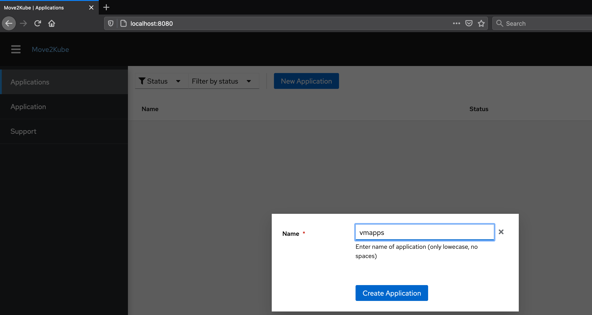
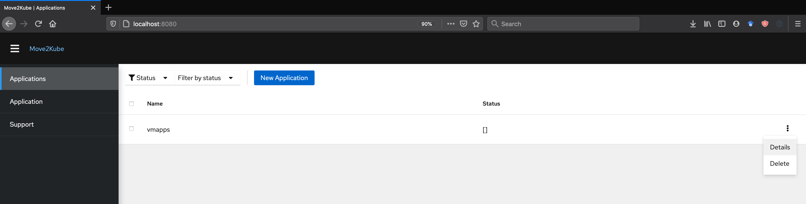
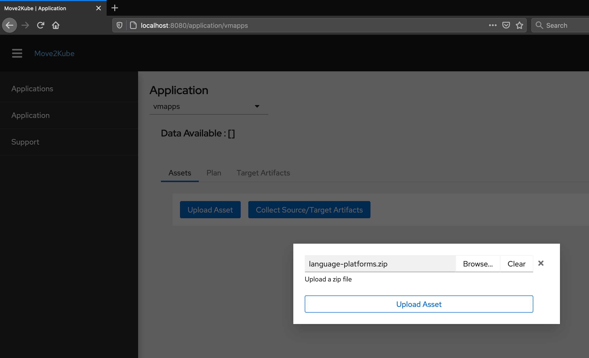
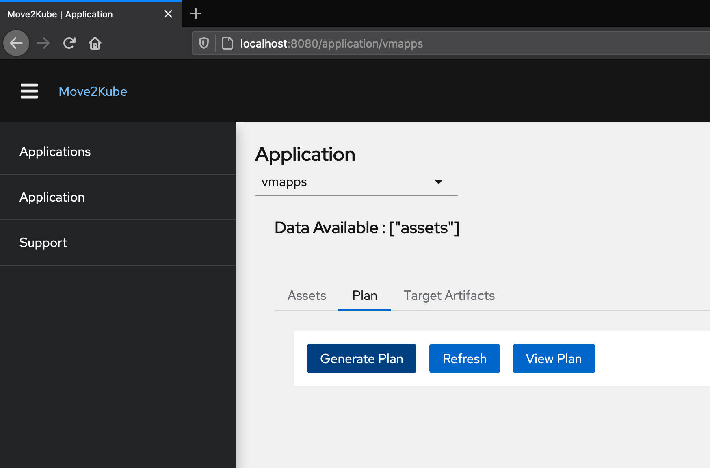
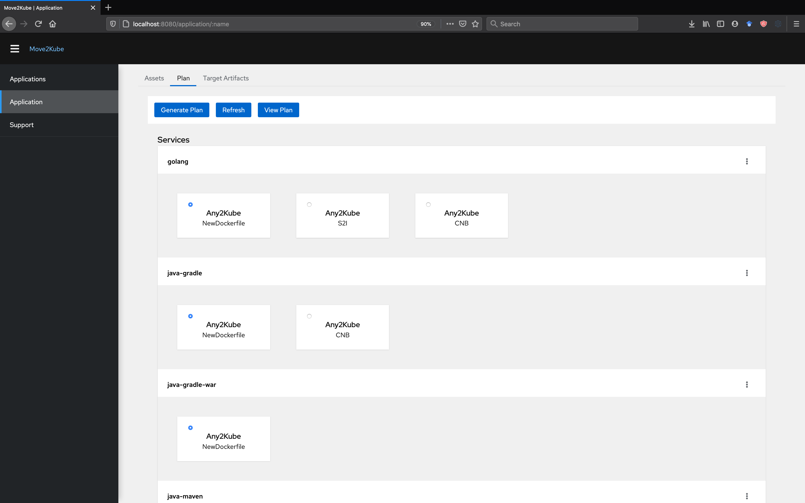
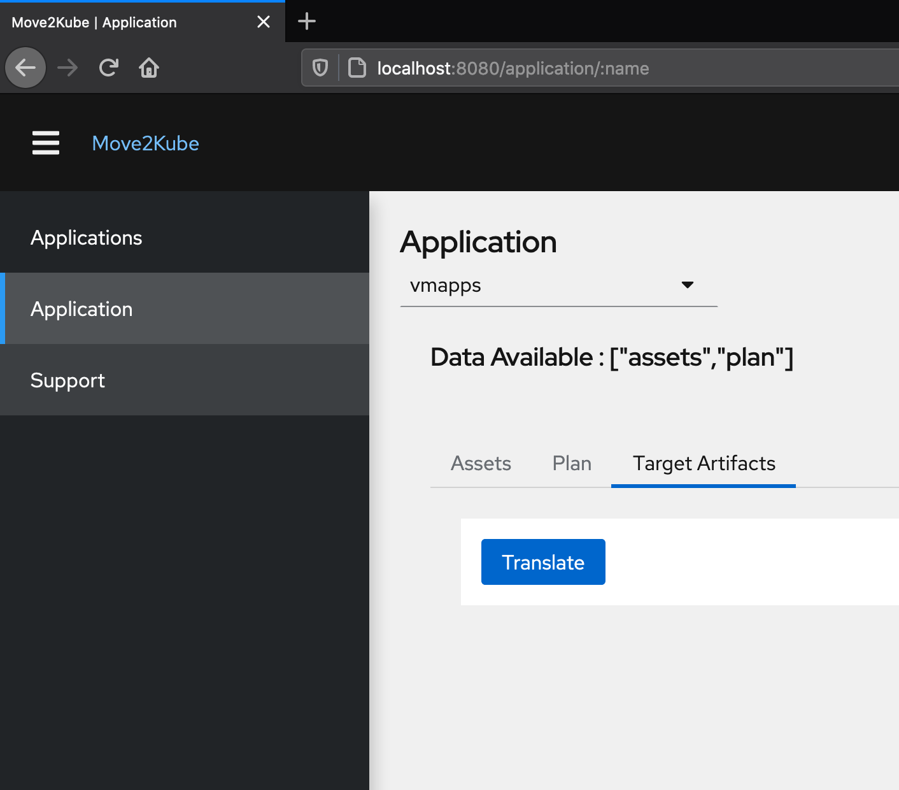
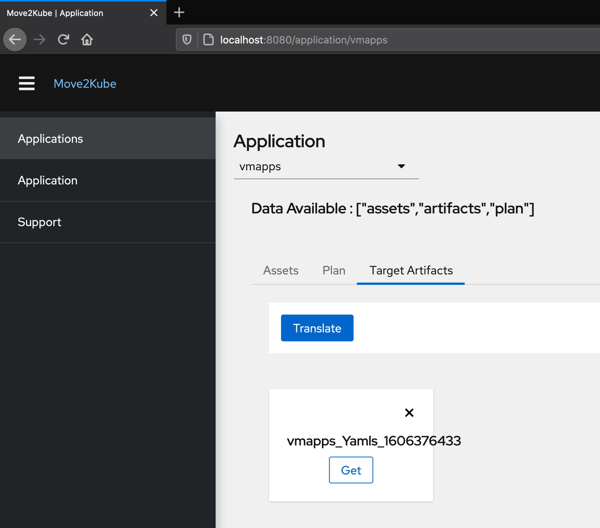

# Using Move2Kube UI

## Description

Similar to the command line tool, Move2Kube Web-UI can also be used to do the translation. The Web-UI has all the capabilities that are there in the command line tool. This document explains the steps to bring up the UI and backend using docker-compose and use it for translation.

## Prerequisites

1. Install [Docker Engine](https://www.docker.com/get-started) and [Docker Compose](https://docs.docker.com/compose/install/#install-compose).

2. Clone the [move2kube-ui](https://github.com/konveyor/move2kube-ui) repository

   ```console
   $ git clone https://github.com/konveyor/move2kube-ui.git

   $ cd move2kube-ui
   ```

   Now, let's see the structure inside the directory.
   ```console
   move2kube-ui git:(master) $ ls
   Dockerfile         README.md          contributing.md    package.json       tsconfig.json      webpack.prod.js
   LICENSE            code-of-conduct.md docker-compose.yml server.js          webpack.common.js  wksps
   Makefile           containers.txt     dr-surge.js        src                webpack.dev.js     yarn.lock
   ```
3. Download [language-platforms.zip](https://github.com/konveyor/move2kube-demos/raw/main/samples/language-platforms.zip) which we will be using for this tutorial. The language-platforms.zip file has a combination of multiple applications in different languages (Java, Go, Python, Ruby, etc.) which needs to be containerized and then put into Kubernetes.

## Steps to generate target artifacts

1. Do a `docker-compose up`.
    ```console
    move2kube-ui git:(master) $ docker-compose up
    Creating network "move2kube-ui_default" with the default driver
    Creating move2kube-ui_move2kubeapi_1 ... done
    Creating move2kube-ui_move2kubeui_1  ... done
    Attaching to move2kube-ui_move2kubeui_1, move2kube-ui_move2kubeapi_1
    move2kubeapi_1  | time="2020-11-25T09:24:44Z" level=info msg="Got files : %!s(<nil>), []"
    move2kubeapi_1  | time="2020-11-25T09:24:44Z" level=info msg="Application : {Name:vmapps Status:[assets artifacts plan]}"
    move2kubeapi_1  | time="2020-11-25T09:24:44Z" level=info msg="About to start translation of application vmapps"
    move2kubeapi_1  | time="2020-11-25T09:24:44Z" level=info msg="About to start translation of application vmapps"
    move2kubeui_1   |
    move2kubeui_1   | > move2kube@0.1.0 start /app
    move2kubeui_1   | > node server.js
    move2kubeui_1   |
    move2kubeui_1   | [HPM] Proxy created: /  -> http://move2kubeapi:8080
    move2kubeui_1   | Listening on port 8080
    ```

    It starts the Move2Kube components that are required for the UI to run. Once it's up, then the UI will be available on the `8080` port.

1. Open `http://localhost:8080/` on your browser.

1. Create a new project `vmapps` by clicking on the `New Application` button.

    

1. Click on the three dots in the end of `vmapps` and select `details`.

    

1. Click on the `Assets` tab and upload the [language-platforms.zip](https://github.com/konveyor/move2kube-demos/blob/main/samples/language-platforms.zip) file which we downloaded earlier in this tutorial.

    

1. Now, go to the `Plan` tab and click on the `Generate Plan` button. Wait for the plan to get generated. It takes about three to five minutes to generate the plan.

    

1. Click on `Refresh` in the plan tab. Once the plan is generated you can see the different services there. You can view the plan by clicking on `View Plan`.

    

1. Go to `Target Artifacts` tab.

    

1. Click on `Translate` button.
1. Answer the questions as apt.

    ```console
    Move2Kube will ask you a few questions, if it requires any assistance. Click Next to start.

    Dynamic 1 : Select all services that are needed:
    [✓] java-gradle
    [✓] java-gradle-war
    [✓] java-maven-war
    [✓] nodejs
    [✓] php
    [✓] python
    [✓] ruby
    [✓] golang
    [✓] java-maven

    Dynamic 2 : Select all containerization modes that is of interest:
    [✓] NewDockerfile
    [ ] S2I
    [ ] CNB

    Dynamic 3 : Select containerization technique's mode for service java-gradle:
      language-platforms/language-platforms/custom-java-gradle-containerizer
    > m2kassets/dockerfiles/javagradle

    Dynamic 4 : Select containerization technique's mode for service java-gradle-war:
    > m2kassets/dockerfiles/java-war-jboss
      m2kassets/dockerfiles/java-war-liberty
      m2kassets/dockerfiles/java-war-tomcat

    Dynamic 5 : Select containerization technique's mode for service java-maven-war:
    > m2kassets/dockerfiles/java-war-jboss
      m2kassets/dockerfiles/java-war-liberty
      m2kassets/dockerfiles/java-war-tomcat

    Dynamic 6 : Choose the artifact type:
    > Yamls
      Helm
      Knative

    Dynamic 7 : Choose the cluster type:
      IBM-IKS
      IBM-Openshift
    > Kubernetes
      Openshift
      AWS-EKS
      Azure-AKS
      GCP-GKE

    Dynamic 8 : Select all services that should be exposed:
    [✓] java-maven-war
    [✓] python
    [✓] nodejs
    [✓] java-gradle
    [✓] java-gradle-war
    [✓] golang
    [✓] java-maven
    [✓] ruby
    [✓] php

    Dynamic 9 : What URL/path should we expose the service java-maven-war on?
    java-maven-war

    Dynamic 10 : What URL/path should we expose the service python on?
    python

    Dynamic 11 : What URL/path should we expose the service nodejs on?
    nodejs

    Dynamic 12 : What URL/path should we expose the service java-gradle on?
    java-gradle

    Dynamic 13 : What URL/path should we expose the service java-gradle-war on?
    java-gradle-war

    Dynamic 14 : What URL/path should we expose the service golang on?
    golang

    Dynamic 15 : What URL/path should we expose the service java-maven on?
    java-maven

    Dynamic 16 : What URL/path should we expose the service ruby on?
    ruby

    Dynamic 17 : What URL/path should we expose the service php on?
    php

    Dynamic 18 : Select the registry where your images are hosted:
    > Other
      docker.io

    Dynamic 19 : Enter the name of the registry :
    us.icr.io

    Dynamic 20 : Enter the namespace where the new images are pushed :
    m2k-tutorial

    Dynamic 21 : [us.icr.io] What type of container registry login do you want to use?
    > Use existing pull secret
      No authentication
      UserName/Password

    Dynamic 22 : [us.icr.io] Enter the name of the pull secret :
    all-icr-io

    Dynamic 23 : Provide the ingress host domain
    irlhc12-cf7808d3396a7c1915bd1818afbfb3c0-0000.us-south.containers.appdomain.cloud

    Dynamic 24 : Provide the TLS secret for ingress


    ```

1. Click on `Get` button to download the generated artifacts as a zip file (here, `vmapps.zip`), extract it and browse them. The applications can now be deployed to Kubernetes using these generated artifacts.

    

## Deploying the application to Kubernetes with the generated target artifacts

1. Extract the `vmapps.zip` file. Now, let's get inside the extracted `vmapps` directory.

    ```console
    $ cd vmapps/
    ```

    The structure of the `vmapps` folder can be seen by executing the below command.

    ```console
    vmapps $ tree
    .
    ├── NOTES.txt
    ├── Readme.md
    ├── buildimages.sh
    ├── cicd
    │   ├── vmapps-clone-build-push-pipeline.yaml
    │   ├── vmapps-clone-push-serviceaccount.yaml
    │   ├── vmapps-git-event-triggerbinding.yaml
    │   ├── vmapps-git-repo-eventlistener.yaml
    │   ├── vmapps-git-repo-ingress.yaml
    │   ├── vmapps-image-registry-secret.yaml
    │   ├── vmapps-run-clone-build-push-triggertemplate.yaml
    │   ├── vmapps-tekton-triggers-admin-role.yaml
    │   ├── vmapps-tekton-triggers-admin-rolebinding.yaml
    │   └── vmapps-tekton-triggers-admin-serviceaccount.yaml
    ├── containers
    │   └── language-platforms
    │       └── language-platforms
    │           ├── golang
    │           │   ├── Dockerfile.golang
    │           │   └── golang-docker-build.sh
    │           ├── java-gradle
    │           │   ├── Dockerfile.java-gradle
    │           │   └── java-gradle-docker-build.sh
    │           ├── java-gradle-war
    │           │   ├── Dockerfile.java-gradle-war
    │           │   └── java-gradle-war-docker-build.sh
    │           ├── java-maven
    │           │   ├── Dockerfile.java-maven
    │           │   └── java-maven-docker-build.sh
    │           ├── java-maven-war
    │           │   ├── Dockerfile.java-maven-war
    │           │   └── java-maven-war-docker-build.sh
    │           ├── nodejs
    │           │   ├── Dockerfile.nodejs
    │           │   └── nodejs-docker-build.sh
    │           ├── php
    │           │   ├── Dockerfile.php
    │           │   └── php-docker-build.sh
    │           ├── python
    │           │   ├── Dockerfile.python
    │           │   └── python-docker-build.sh
    │           └── ruby
    │               ├── Dockerfile.ruby
    │               └── ruby-docker-build.sh
    ├── copysources.sh
    ├── deploy.sh
    ├── docker-compose.yaml
    ├── m2kqacache.yaml
    ├── pushimages.sh
    └── vmapps
        ├── golang-deployment.yaml
        ├── golang-service.yaml
        ├── java-gradle-deployment.yaml
        ├── java-gradle-service.yaml
        ├── java-gradle-war-deployment.yaml
        ├── java-gradle-war-service.yaml
        ├── java-maven-deployment.yaml
        ├── java-maven-service.yaml
        ├── java-maven-war-deployment.yaml
        ├── java-maven-war-service.yaml
        ├── nodejs-deployment.yaml
        ├── nodejs-service.yaml
        ├── php-deployment.yaml
        ├── php-service.yaml
        ├── python-deployment.yaml
        ├── python-service.yaml
        ├── ruby-deployment.yaml
        ├── ruby-service.yaml
        └── vmapps-ingress.yaml
    ```

    The UI has created Yamls for us which are stored inside the *./vmapps* directory. For each of the folders and the services identified, it has created the deployment artifacts, service artifacts and the ingress as required.  The *./containers* folder contains the scripts for building the images for the applications using Dockerfiles.

    Many scripts like *buildimages.sh*, *copysources.sh* and *deploy.sh* are also present inside the folder. It has also created a simple *docker-compose.yaml* for you, so that you can test the images locally if you want. It has also created Tekton artifacts inside the *./cicd* directory that are required if you want to use Tekton as your CI/CD pipeline.

    The *Readme.md* file guides on the next steps to be followed.

    ```console
    vmapps $ cat Readme.md
    Move2Kube
    ---------
    Congratulations! Move2Kube has generated the necessary build artfiacts for moving all your application components to Kubernetes. Using the artifacts in this directory you can deploy your application in a kubernetes cluster.

    Prerequisites
    -------------
    * Docker
    * Helm
    * Kubectl
    * Source-To-Image (S2I) https://github.com/openshift/source-to-image

    Next Steps
    ----------
    * Copy the source directory into the containers folder for packaging as containers using "copysource.sh <SRC_DIR>"
    * Build your images using "buildimages.sh"
    * Push images to registry "pushimages.sh <REGISTRY_URL> <REGISTRY_NAMESPACE>"
    * Use "deploy.sh" to deploy your artifacts into a kubernetes cluster.

    IMPORTANT!!: If you used the UI for translation then "copysources.sh" may copy to the wrong folder.  
    This is a limitation of the beta version. It should be fixed in future versions of move2kube-ui.  
    In the meantime you can either:
    - copy the sources to the appropriate folders inside "./containers/" manually. "./containers/" has  
      the same folder structure as the sources folder so simply copy the appropriate source files/folders  
      to the corresponding folders inside "./containers/".
    - move the sources into a directory with the same name and then try copysources with that.  
      Example: if sources is a folder called "foo" you might try moving it into "foo/foo/foo" and then  
      doing "./copysources.sh path/to/foo/". This will require you to read "copysource.sh" and have some knowledge  
      of how "cp -r" works in order to get it right.
    ```

2. The source folder `language-platforms` can be obtained by extracting the [language-platform.zip](https://github.com/konveyor/move2kube-demos/raw/main/samples/language-platforms.zip). Create a folder `source` and create a sub-folder `language-platforms` within the `source` folder. Now paste the extracted `language-platforms` folder inside `source/language-platforms` folder. Then, our source artifacts will be inside `source/language-platforms/language-platforms`.  

3. We will now run the `copysources.sh` script and provide path to the above `source` folder.

    ```console
    vmapps $ ./copysources.sh path/to/source
    ```

4. Next we run the *buildimages.sh* script. This step may take some time to complete.

    ```console
    vmapps $ ./buildimages.sh
    ```

5. Now using the *pushimages.sh* script we can push our applications images to the registry that we specified during the *translate* phase. For this step, you are required to log in to the Docker registry. To log in to IBM Cloud `us.icr.io` registry refer [here](https://cloud.ibm.com/docs/Registry?topic=Registry-registry_access#registry_access_apikey_auth_docker).

    ```console
    vmapps $ ./pushimages.sh
    The push refers to repository [us.icr.io/m2k-tutorial/java-gradle]
    ffa6465f54ab: Layer already exists
    86b4d79b8cb0: Layer already exists
    02ff5ceaada2: Layer already exists
    0e270d27988f: Layer already exists
    latest: digest: sha256:ed342fa94468694ffe008b086118f73e12a8632fe3660bf55bcdd18c927d9b24 size: 1159
    The push refers to repository [us.icr.io/m2k-tutorial/php]
    dd6584782bd2: Layer already exists
    a0866fd3790f: Layer already exists
    af0415ae8e8e: Layer already exists
    37330a2a1954: Layer already exists
    d6ec160dc60f: Layer already exists
    latest: digest: sha256:df7667a28d9f4f61882d3d766bfe81d5c3d825779037a530f860c18660af7b91 size: 1363
    The push refers to repository [us.icr.io/m2k-tutorial/golang]
    733c29e84165: Layer already exists
    37330a2a1954: Layer already exists
    d6ec160dc60f: Layer already exists
    latest: digest: sha256:333f0c18ea6eef935d7c0d4b7fbb4cf5dec86daedb9df487eda4319c9a5f2d94 size: 948
    The push refers to repository [us.icr.io/m2k-tutorial/ruby]
    f16699d2aa6e: Layer already exists
    5f70bf18a086: Layer already exists
    4e831229fd04: Layer already exists
    b2d4bf2f278b: Layer already exists
    b06524155a81: Layer already exists
    cdfb3bbd8e3d: Layer already exists
    4a037f2b85d2: Layer already exists
    059ed1793a98: Layer already exists
    712264374d24: Layer already exists
    475b4eb79695: Layer already exists
    f3be340a54b9: Layer already exists
    114ca5b7280f: Layer already exists
    latest: digest: sha256:1a006f3e79d166f6b7c3fbca605e2f86455daae84bea56dd9764495eb0e31b47 size: 3041
    The push refers to repository [us.icr.io/m2k-tutorial/java-gradle-war]
    1355509f8056: Layer already exists
    86b4d79b8cb0: Layer already exists
    02ff5ceaada2: Layer already exists
    0e270d27988f: Layer already exists
    latest: digest: sha256:13bd95d8e2c75be32bde6a0517800f178e56ae7a404704ee34eb8f3d412c5de4 size: 1159
    The push refers to repository [us.icr.io/m2k-tutorial/java-maven-war]
    f17093c7b214: Layer already exists
    86b4d79b8cb0: Layer already exists
    02ff5ceaada2: Layer already exists
    0e270d27988f: Layer already exists
    latest: digest: sha256:8b93e8b77dfb1d3f22006256f11a7fd4651f87eda47dd7ccbf635d328c2a8a27 size: 1158
    The push refers to repository [us.icr.io/m2k-tutorial/python]
    9d8df9196737: Layer already exists
    cf00287de132: Layer already exists
    4f21df0c5ff4: Layer already exists
    3523d1de2809: Layer already exists
    7a9f4af0a3a5: Layer already exists
    af7dc60e1bfb: Layer already exists
    37ab7f712dcb: Layer already exists
    0b5feeefca25: Layer already exists
    latest: digest: sha256:8bc990dcd6aa41b8bbbf9f64c06edc3560d99876f804368118740c867d05f9a8 size: 1999
    The push refers to repository [us.icr.io/m2k-tutorial/nodejs]
    24f1b33525cc: Layer already exists
    241d3736dfbf: Layer already exists
    e5702422d6b2: Layer already exists
    7a9f4af0a3a5: Layer already exists
    af7dc60e1bfb: Layer already exists
    37ab7f712dcb: Layer already exists
    0b5feeefca25: Layer already exists
    latest: digest: sha256:7f67917e2e90e4ee9d5f28152bf97c7272787a22befd8645f5e3adf50895949a size: 1789
    The push refers to repository [us.icr.io/m2k-tutorial/java-maven]
    eb4fde40c423: Layer already exists
    86b4d79b8cb0: Layer already exists
    02ff5ceaada2: Layer already exists
    0e270d27988f: Layer already exists
    latest: digest: sha256:524b1308fb013f37570db1eb9375d2a71340d01c85e438b206cbec90a542086b size: 1158
    ```

6. Finally we are going to deploy the applications using the *deploy.sh* script.

   ```console
   vmapps $ ./deploy.sh
   deployment.apps/golang configured
   service/golang configured
   deployment.apps/java-gradle configured
   service/java-gradle configured
   deployment.apps/java-gradle-war configured
   service/java-gradle-war configured
   deployment.apps/java-maven configured
   service/java-maven configured
   deployment.apps/java-maven-war configured
   service/java-maven-war configured
   deployment.apps/nodejs configured
   service/nodejs configured
   deployment.apps/php configured
   service/php configured
   deployment.apps/python configured
   service/python configured
   deployment.apps/ruby configured
   service/ruby configured
   ingress.networking.k8s.io/vmapps configured


   The services are accessible on the following paths:
   golang : http://vmapps.irlhc12-cf7808d3396a7c1915bd1818afbfb3c0-0000.us-south.containers.appdomain.cloud/golang
   java-gradle : http://vmapps.irlhc12-cf7808d3396a7c1915bd1818afbfb3c0-0000.us-south.containers.appdomain.cloud/java-gradle
   java-gradle-war : http://vmapps.irlhc12-cf7808d3396a7c1915bd1818afbfb3c0-0000.us-south.containers.appdomain.cloud/java-gradle-war
   java-maven : http://vmapps.irlhc12-cf7808d3396a7c1915bd1818afbfb3c0-0000.us-south.containers.appdomain.cloud/java-maven
   java-maven-war : http://vmapps.irlhc12-cf7808d3396a7c1915bd1818afbfb3c0-0000.us-south.containers.appdomain.cloud/java-maven-war
   nodejs : http://vmapps.irlhc12-cf7808d3396a7c1915bd1818afbfb3c0-0000.us-south.containers.appdomain.cloud/nodejs
   php : http://vmapps.irlhc12-cf7808d3396a7c1915bd1818afbfb3c0-0000.us-south.containers.appdomain.cloud/php
   python : http://vmapps.irlhc12-cf7808d3396a7c1915bd1818afbfb3c0-0000.us-south.containers.appdomain.cloud/python
   ruby : http://vmapps.irlhc12-cf7808d3396a7c1915bd1818afbfb3c0-0000.us-south.containers.appdomain.cloud/ruby
   ```

Now, all our applications are accessible on the paths given below.

* golang app- `http://vmapps.irlhc12-cf7808d3396a7c1915bd1818afbfb3c0-0000.us-south.containers.appdomain.cloud/golang`

   

* java-gradle app- `http://vmapps.irlhc12-cf7808d3396a7c1915bd1818afbfb3c0-0000.us-south.containers.appdomain.cloud/java-gradle`

  

* java-maven app- `http://vmapps.irlhc12-cf7808d3396a7c1915bd1818afbfb3c0-0000.us-south.containers.appdomain.cloud/java-maven`

   

* nodejs app- `http://vmapps.irlhc12-cf7808d3396a7c1915bd1818afbfb3c0-0000.us-south.containers.appdomain.cloud/nodejs`

   

* php app- `http://vmapps.irlhc12-cf7808d3396a7c1915bd1818afbfb3c0-0000.us-south.containers.appdomain.cloud/php`

   

* python app- `http://vmapps.irlhc12-cf7808d3396a7c1915bd1818afbfb3c0-0000.us-south.containers.appdomain.cloud/python`

   

* ruby app- `http://vmapps.irlhc12-cf7808d3396a7c1915bd1818afbfb3c0-0000.us-south.containers.appdomain.cloud/ruby`

   

So, you can have a very diverse source environment, like the [language-platforms](https://github.com/konveyor/move2kube-demos/tree/main/samples/language-platforms) having multiple applications in different languages, and in a very simple way you can containerize and deploy them to Kubernetes. All the features in the Move2Kube Command-line tool are available through the UI tool.
