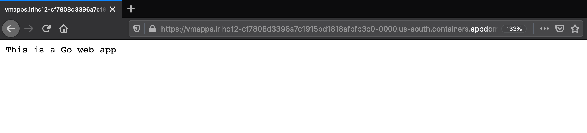
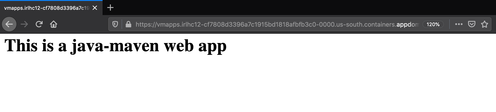
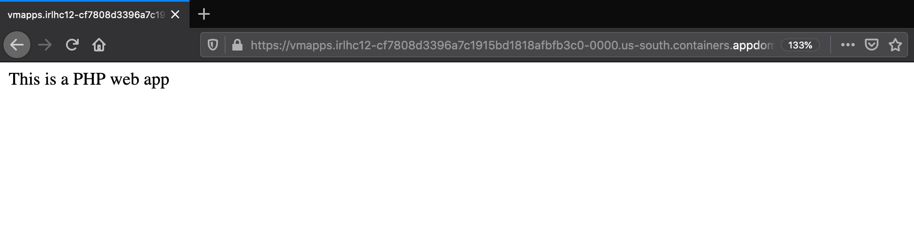
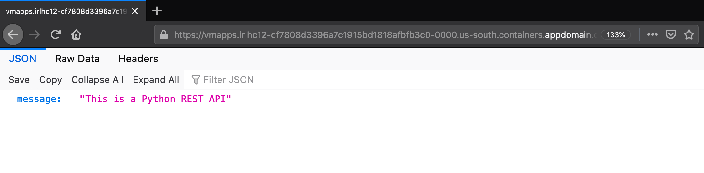

# Using Move2Kube UI

## Description

Similar to the command line tool, Move2Kube Web-UI can also be used to do the transformation. The Web-UI has all the capabilities that are there in the command line tool. This document explains the steps to bring up the UI and backend using docker and use it for transformation.

## Prerequisites

1. Install [Docker Engine](https://www.docker.com/get-started).

1. Download [language-platforms.zip](https://github.com/konveyor/move2kube-demos/raw/main/samples/language-platforms.zip) which we will be using for this tutorial. The language-platforms.zip file has a combination of multiple applications in different languages (Java, Go, Python, Ruby, etc.) which needs to be containerized and then put into Kubernetes.

## Steps to generate target artifacts

1. Do a `docker run --rm -it -p 8080:8080 quay.io/konveyor/move2kube-ui`.  
(Optional: If you need persistence then add `-v "${PWD}/data:/move2kube-api/data"` to mount the current directory).  
(Optional: If you need advanced features of Move2Kube then add `-v //var/run/docker.sock:/var/run/docker.sock` to mount the docker socket).
    ```console
    $ docker run --rm -it -p 8080:8080 quay.io/konveyor/move2kube-ui
    INFO[0000] Starting Move2Kube API server at port: 8080
    ```

    It starts a container using the Move2Kube UI image. Once it's up the UI will be available on port `8080`.

1. Open `http://localhost:8080/` in your browser.

1. Create a new workspace `Workspace 1` by clicking on the `New Workspace` button.

    
    
    

1. Scroll down and create a new project `Project 1` by clicking on the `New Project` button.

    
    
    

1. Scroll down to the `Project inputs` section and upload the [language-platforms.zip](https://github.com/konveyor/move2kube-demos/blob/main/samples/language-platforms.zip) file which we downloaded earlier in this tutorial and wait for it to finish uploading.

    
    
    

1. Now scroll down to the `Plan` section and click on the `Start Planning` button. Wait for the plan to get generated. It takes about three to five minutes to generate the plan.

    
    

1. Once the plan is generated you can scroll to see the different services. The plan is in YAML format. If you edit the plan don't forget to click `Save`.

    

1. Now scroll down to `Outputs` section and click on the `Start Transformation` button.

    

1. Move2Kube will ask some questions to aid in the transfomation process. You can keep clicking the `Next` button and go with the default answers for now.

    
    
    
    
    
    
    
    
    
    
    
    
    
    
    
    
    
    

1. After the questions are finished wait a few minutes for it to finish processing. Once it's done, you can click on the output to download the generated artifacts as a zip file (here `workspace-1-project-1-output-1989fd2d-4be1-4316-b368-309f5349cfad.zip`), extract it and browse them. The applications can now be deployed to Kubernetes using these generated artifacts.

    
    

## Deploying the application to Kubernetes with the generated target artifacts

1. After extracting the output zip file, let's go inside the extracted `output` directory.

    
    
    

1. Looking at the output folder in VSCode we can see the following structure:

    

    The full structure of the `output` folder can be seen by executing the `tree` command.

    ```console
    $ cd output/
    $ tree
    .
    ├── m2k.plan
    ├── m2kconfig.yaml
    ├── m2kqacache.yaml
    └── project-1
        ├── Readme.md
        ├── deploy
        │   ├── cicd
        │   │   ├── tekton
        │   │   │   ├── project-1-clone-build-push-pipeline.yaml
        │   │   │   ├── project-1-clone-push-serviceaccount.yaml
        │   │   │   ├── project-1-git-event-triggerbinding.yaml
        │   │   │   ├── project-1-git-repo-eventlistener.yaml
        │   │   │   ├── project-1-image-registry-secret.yaml
        │   │   │   ├── project-1-ingress.yaml
        │   │   │   ├── project-1-run-clone-build-push-triggertemplate.yaml
        │   │   │   ├── project-1-tekton-triggers-admin-role.yaml
        │   │   │   ├── project-1-tekton-triggers-admin-rolebinding.yaml
        │   │   │   └── project-1-tekton-triggers-admin-serviceaccount.yaml
        │   │   └── tekton-parameterized
        │   │       ├── helm-chart
        │   │       │   └── project-1
        │   │       │       ├── Chart.yaml
        │   │       │       └── templates
        │   │       │           ├── project-1-clone-build-push-pipeline.yaml
        │   │       │           ├── project-1-clone-push-serviceaccount.yaml
        │   │       │           ├── project-1-git-event-triggerbinding.yaml
        │   │       │           ├── project-1-git-repo-eventlistener.yaml
        │   │       │           ├── project-1-image-registry-secret.yaml
        │   │       │           ├── project-1-ingress.yaml
        │   │       │           ├── project-1-run-clone-build-push-triggertemplate.yaml
        │   │       │           ├── project-1-tekton-triggers-admin-role.yaml
        │   │       │           ├── project-1-tekton-triggers-admin-rolebinding.yaml
        │   │       │           └── project-1-tekton-triggers-admin-serviceaccount.yaml
        │   │       ├── kustomize
        │   │       │   └── base
        │   │       │       ├── kustomization.yaml
        │   │       │       ├── project-1-clone-build-push-pipeline.yaml
        │   │       │       ├── project-1-clone-push-serviceaccount.yaml
        │   │       │       ├── project-1-git-event-triggerbinding.yaml
        │   │       │       ├── project-1-git-repo-eventlistener.yaml
        │   │       │       ├── project-1-image-registry-secret.yaml
        │   │       │       ├── project-1-ingress.yaml
        │   │       │       ├── project-1-run-clone-build-push-triggertemplate.yaml
        │   │       │       ├── project-1-tekton-triggers-admin-role.yaml
        │   │       │       ├── project-1-tekton-triggers-admin-rolebinding.yaml
        │   │       │       └── project-1-tekton-triggers-admin-serviceaccount.yaml
        │   │       └── openshift-template
        │   │           └── template.yaml
        │   ├── compose
        │   │   └── docker-compose.yaml
        │   ├── knative
        │   │   ├── app-service.yaml
        │   │   ├── main-service.yaml
        │   │   ├── project-1-php-service.yaml
        │   │   └── project-1-python-service.yaml
        │   ├── knative-parameterized
        │   │   ├── helm-chart
        │   │   │   └── project-1
        │   │   │       ├── Chart.yaml
        │   │   │       └── templates
        │   │   │           ├── app-service.yaml
        │   │   │           ├── main-service.yaml
        │   │   │           ├── project-1-php-service.yaml
        │   │   │           └── project-1-python-service.yaml
        │   │   ├── kustomize
        │   │   │   └── base
        │   │   │       ├── app-service.yaml
        │   │   │       ├── kustomization.yaml
        │   │   │       ├── main-service.yaml
        │   │   │       ├── project-1-php-service.yaml
        │   │   │       └── project-1-python-service.yaml
        │   │   └── openshift-template
        │   │       └── template.yaml
        │   ├── yamls
        │   │   ├── app-deployment.yaml
        │   │   ├── app-service.yaml
        │   │   ├── main-deployment.yaml
        │   │   ├── main-service.yaml
        │   │   ├── project-1-ingress.yaml
        │   │   ├── project-1-php-deployment.yaml
        │   │   ├── project-1-php-service.yaml
        │   │   ├── project-1-python-deployment.yaml
        │   │   └── project-1-python-service.yaml
        │   └── yamls-parameterized
        │       ├── helm-chart
        │       │   └── project-1
        │       │       ├── Chart.yaml
        │       │       └── templates
        │       │           ├── app-deployment.yaml
        │       │           ├── app-service.yaml
        │       │           ├── main-deployment.yaml
        │       │           ├── main-service.yaml
        │       │           ├── project-1-ingress.yaml
        │       │           ├── project-1-php-deployment.yaml
        │       │           ├── project-1-php-service.yaml
        │       │           ├── project-1-python-deployment.yaml
        │       │           └── project-1-python-service.yaml
        │       ├── kustomize
        │       │   └── base
        │       │       ├── app-deployment.yaml
        │       │       ├── app-service.yaml
        │       │       ├── kustomization.yaml
        │       │       ├── main-deployment.yaml
        │       │       ├── main-service.yaml
        │       │       ├── project-1-ingress.yaml
        │       │       ├── project-1-php-deployment.yaml
        │       │       ├── project-1-php-service.yaml
        │       │       ├── project-1-python-deployment.yaml
        │       │       └── project-1-python-service.yaml
        │       └── openshift-template
        │           └── template.yaml
        ├── scripts
        │   ├── builddockerimages.bat
        │   ├── builddockerimages.sh
        │   ├── buildimages.bat
        │   ├── buildimages.sh
        │   ├── pushimages.bat
        │   └── pushimages.sh
        └── source
            └── language-platforms
                └── language-platforms
                    ├── golang
                    │   └── main.go
                    ├── java-gradle
                    │   ├── build.gradle
                    │   └── src
                    │       └── main
                    │           ├── java
                    │           │   └── simplewebapp
                    │           │       └── MainServlet.java
                    │           └── webapp
                    │               └── WEB-INF
                    │                   └── web.xml
                    ├── java-gradle-war
                    │   └── java-gradle-war.war
                    ├── java-maven
                    │   ├── pom.xml
                    │   └── src
                    │       └── main
                    │           └── webapp
                    │               ├── WEB-INF
                    │               │   └── web.xml
                    │               └── index.jsp
                    ├── java-maven-war
                    │   └── java-maven-war.war
                    ├── nodejs
                    │   ├── Dockerfile
                    │   ├── main.js
                    │   └── package.json
                    ├── php
                    │   └── php
                    │       ├── Dockerfile
                    │       └── index.php
                    ├── python
                    │   ├── Dockerfile
                    │   ├── main.py
                    │   └── requirements.txt
                    └── ruby
                        ├── Dockerfile
                        ├── Gemfile
                        ├── app.rb
                        ├── config.ru
                        └── views
                            └── main.erb

    53 directories, 111 files
    ```

    The UI has created Kubernetes YAMLs for us which are stored inside the `project-1/deploy/yamls` directory. For each of the folders and the services identified, it has created the deployment artifacts, service artifacts and the ingress as required.  The `project-1/scripts` folder contains the scripts for building the images for the applications using Dockerfiles.

    Many scripts like `buildimages.sh` and `pushimages.sh` are also present inside the folder. It has also created a simple `project-1/deploy/compose/docker-compose.yaml` for you, so that you can test the images locally if you want. It has also created Tekton artifacts inside the `project-1/deploy/cicd/tekton` directory that are required if you want to use Tekton as your CI/CD pipeline.

    The `Readme.md` file guides on the next steps to be followed.

    ```
    Move2Kube
    ---------
    Congratulations! Move2Kube has generated the necessary build artfiacts for moving all your application components to Kubernetes. Using the artifacts in this directory you can deploy your application in a kubernetes cluster.

    Next Steps
    ----------
    To try locally use the scripts in the "./scripts" directory, to build, push and deploy. 

    For production usage use the CI/CD pipelines for deployment.
    ```

2. Next we run the `buildimages.sh` script. Make sure to run this from the `project-1` directory. This step may take some time to complete.

    ```console
    $ cd project-1/
    $ ./scripts/buildimages.sh
    ```

3. Now using the `pushimages.sh` script we can push our applications images to the registry that we specified during the `transform` phase. For this step, you are required to log in to the Docker registry. To log in to IBM Cloud `us.icr.io` registry refer [here](https://cloud.ibm.com/docs/Registry?topic=Registry-registry_access#registry_access_apikey_auth_docker).

    ```console
    $ ./scripts/pushimages.sh
    The push refers to repository [us.icr.io/m2k-tutorial/java-gradle]
    ffa6465f54ab: Layer already exists
    86b4d79b8cb0: Layer already exists
    02ff5ceaada2: Layer already exists
    0e270d27988f: Layer already exists
    latest: digest: sha256:ed342fa94468694ffe008b086118f73e12a8632fe3660bf55bcdd18c927d9b24 size: 1159
    The push refers to repository [us.icr.io/m2k-tutorial/php]
    dd6584782bd2: Layer already exists
    a0866fd3790f: Layer already exists
    af0415ae8e8e: Layer already exists
    37330a2a1954: Layer already exists
    d6ec160dc60f: Layer already exists
    latest: digest: sha256:df7667a28d9f4f61882d3d766bfe81d5c3d825779037a530f860c18660af7b91 size: 1363
    The push refers to repository [us.icr.io/m2k-tutorial/golang]
    733c29e84165: Layer already exists
    37330a2a1954: Layer already exists
    d6ec160dc60f: Layer already exists
    latest: digest: sha256:333f0c18ea6eef935d7c0d4b7fbb4cf5dec86daedb9df487eda4319c9a5f2d94 size: 948
    The push refers to repository [us.icr.io/m2k-tutorial/ruby]
    f16699d2aa6e: Layer already exists
    5f70bf18a086: Layer already exists
    4e831229fd04: Layer already exists
    b2d4bf2f278b: Layer already exists
    b06524155a81: Layer already exists
    cdfb3bbd8e3d: Layer already exists
    4a037f2b85d2: Layer already exists
    059ed1793a98: Layer already exists
    712264374d24: Layer already exists
    475b4eb79695: Layer already exists
    f3be340a54b9: Layer already exists
    114ca5b7280f: Layer already exists
    latest: digest: sha256:1a006f3e79d166f6b7c3fbca605e2f86455daae84bea56dd9764495eb0e31b47 size: 3041
    The push refers to repository [us.icr.io/m2k-tutorial/java-gradle-war]
    1355509f8056: Layer already exists
    86b4d79b8cb0: Layer already exists
    02ff5ceaada2: Layer already exists
    0e270d27988f: Layer already exists
    latest: digest: sha256:13bd95d8e2c75be32bde6a0517800f178e56ae7a404704ee34eb8f3d412c5de4 size: 1159
    The push refers to repository [us.icr.io/m2k-tutorial/java-maven-war]
    f17093c7b214: Layer already exists
    86b4d79b8cb0: Layer already exists
    02ff5ceaada2: Layer already exists
    0e270d27988f: Layer already exists
    latest: digest: sha256:8b93e8b77dfb1d3f22006256f11a7fd4651f87eda47dd7ccbf635d328c2a8a27 size: 1158
    The push refers to repository [us.icr.io/m2k-tutorial/python]
    9d8df9196737: Layer already exists
    cf00287de132: Layer already exists
    4f21df0c5ff4: Layer already exists
    3523d1de2809: Layer already exists
    7a9f4af0a3a5: Layer already exists
    af7dc60e1bfb: Layer already exists
    37ab7f712dcb: Layer already exists
    0b5feeefca25: Layer already exists
    latest: digest: sha256:8bc990dcd6aa41b8bbbf9f64c06edc3560d99876f804368118740c867d05f9a8 size: 1999
    The push refers to repository [us.icr.io/m2k-tutorial/nodejs]
    24f1b33525cc: Layer already exists
    241d3736dfbf: Layer already exists
    e5702422d6b2: Layer already exists
    7a9f4af0a3a5: Layer already exists
    af7dc60e1bfb: Layer already exists
    37ab7f712dcb: Layer already exists
    0b5feeefca25: Layer already exists
    latest: digest: sha256:7f67917e2e90e4ee9d5f28152bf97c7272787a22befd8645f5e3adf50895949a size: 1789
    The push refers to repository [us.icr.io/m2k-tutorial/java-maven]
    eb4fde40c423: Layer already exists
    86b4d79b8cb0: Layer already exists
    02ff5ceaada2: Layer already exists
    0e270d27988f: Layer already exists
    latest: digest: sha256:524b1308fb013f37570db1eb9375d2a71340d01c85e438b206cbec90a542086b size: 1158
    ```

4. Finally we are going to deploy the applications using the `deploy.sh` script. If the deploy script is missing, you can also deploy by doing `kubectl apply -f ./deploy/yamls`

   ```console
   $ ./scripts/deploy.sh
   deployment.apps/golang configured
   service/golang configured
   deployment.apps/java-gradle configured
   service/java-gradle configured
   deployment.apps/java-gradle-war configured
   service/java-gradle-war configured
   deployment.apps/java-maven configured
   service/java-maven configured
   deployment.apps/java-maven-war configured
   service/java-maven-war configured
   deployment.apps/nodejs configured
   service/nodejs configured
   deployment.apps/php configured
   service/php configured
   deployment.apps/python configured
   service/python configured
   deployment.apps/ruby configured
   service/ruby configured
   ingress.networking.k8s.io/project-1 configured


   The services are accessible on the following paths:
   golang : http://project-1.irlhc12-cf7808d3396a7c1915bd1818afbfb3c0-0000.us-south.containers.appdomain.cloud/golang
   java-gradle : http://project-1.irlhc12-cf7808d3396a7c1915bd1818afbfb3c0-0000.us-south.containers.appdomain.cloud/java-gradle
   java-gradle-war : http://project-1.irlhc12-cf7808d3396a7c1915bd1818afbfb3c0-0000.us-south.containers.appdomain.cloud/java-gradle-war
   java-maven : http://project-1.irlhc12-cf7808d3396a7c1915bd1818afbfb3c0-0000.us-south.containers.appdomain.cloud/java-maven
   java-maven-war : http://project-1.irlhc12-cf7808d3396a7c1915bd1818afbfb3c0-0000.us-south.containers.appdomain.cloud/java-maven-war
   nodejs : http://project-1.irlhc12-cf7808d3396a7c1915bd1818afbfb3c0-0000.us-south.containers.appdomain.cloud/nodejs
   php : http://project-1.irlhc12-cf7808d3396a7c1915bd1818afbfb3c0-0000.us-south.containers.appdomain.cloud/php
   python : http://project-1.irlhc12-cf7808d3396a7c1915bd1818afbfb3c0-0000.us-south.containers.appdomain.cloud/python
   ruby : http://project-1.irlhc12-cf7808d3396a7c1915bd1818afbfb3c0-0000.us-south.containers.appdomain.cloud/ruby
   ```

Now all our applications are accessible on the paths given below.

* golang app- `http://project-1.irlhc12-cf7808d3396a7c1915bd1818afbfb3c0-0000.us-south.containers.appdomain.cloud/golang`

   

* java-gradle app- `http://project-1.irlhc12-cf7808d3396a7c1915bd1818afbfb3c0-0000.us-south.containers.appdomain.cloud/java-gradle`

  

* java-maven app- `http://project-1.irlhc12-cf7808d3396a7c1915bd1818afbfb3c0-0000.us-south.containers.appdomain.cloud/java-maven`

   

* nodejs app- `http://project-1.irlhc12-cf7808d3396a7c1915bd1818afbfb3c0-0000.us-south.containers.appdomain.cloud/nodejs`

   

* php app- `http://project-1.irlhc12-cf7808d3396a7c1915bd1818afbfb3c0-0000.us-south.containers.appdomain.cloud/php`

   

* python app- `http://project-1.irlhc12-cf7808d3396a7c1915bd1818afbfb3c0-0000.us-south.containers.appdomain.cloud/python`

   

* ruby app- `http://project-1.irlhc12-cf7808d3396a7c1915bd1818afbfb3c0-0000.us-south.containers.appdomain.cloud/ruby`

   

So, you can have a very diverse source environment, like the [language-platforms](https://github.com/konveyor/move2kube-demos/tree/main/samples/language-platforms) having multiple applications in different languages, and in a very simple way you can containerize and deploy them to Kubernetes. All the features in the Move2Kube Command-line tool are available through the UI tool.
