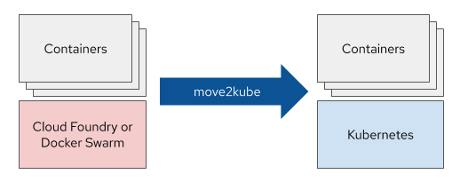

# What is Move2Kube?

A tool that accelerates the process of re-platforming to Kubernetes by analyzing source artifacts.

## Move2Kube

Move2Kube is a command line tool that uses source artifacts such as docker compose files or cloud foundry manifest files, and even source code to generate kubernetes deployment artifacts including object yaml, helm charts, and operators.

## Usage

Move2Kube takes as input the source artifacts and outputs the target deployment artifacts.

For more detailed information :
* [Installation](./install.md)
* [Getting Started](./GettingStarted.md)
* [Tutorials](./Tutorials.md)

## Discussion

To discuss with the maintainers, reach out in [slack](https://kubernetes.slack.com/archives/CR85S82A2) in [kubernetes](https://slack.k8s.io/) workspace or reach out to us in the [forum](https://groups.google.com/g/konveyorio).
