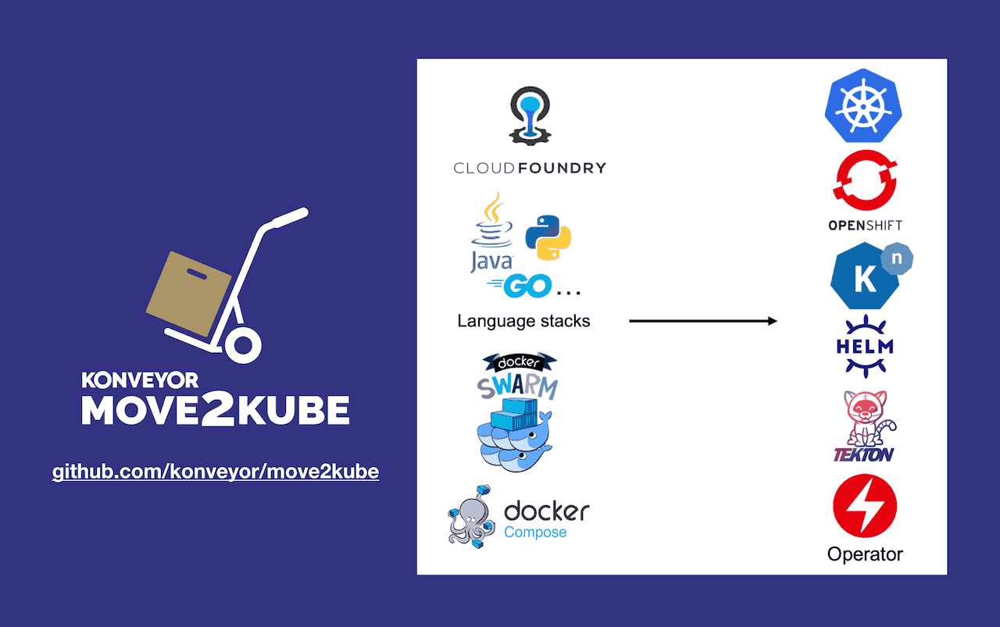

# Konveyor Move2Kube

## What is Move2Kube?

A tool that accelerates the process of re-platforming to Kubernetes by analyzing source artifacts.



Move2Kube is a tool that uses source artifacts such as docker compose files or cloud foundry manifest files, and even source code to generate kubernetes deployment artifacts including object yaml, helm charts, and operators.

## A quick start with Move2Kube
With Move2Kube, generating the Kubernetes/OpenShift deployment artifacts for your source platform artifacts is now simple.

1. Install Move2Kube
   ```console
   $ curl -L https://raw.githubusercontent.com/konveyor/move2kube/master/scripts/install.sh | bash -
   ```

1. Use [our sample docker-compose.yaml](https://raw.githubusercontent.com/konveyor/move2kube-demos/main/samples/docker-compose/docker-compose.yaml) file or your own

   ```console
   $ wget -P samples/docker-compose/ https://raw.githubusercontent.com/konveyor/move2kube-demos/main/samples/docker-compose/docker-compose.yaml

   $ cd samples

   $ move2kube translate -s docker-compose
   ```
1. Answer the questions and you will get the yaml files required for deploying the docker compose files in kubernetes inside the `myproject` directory.
<p align="center">
<script id="asciicast-bbcIy29E2eLyzdwSDsvmJED1C" src="https://asciinema.org/a/bbcIy29E2eLyzdwSDsvmJED1C.js" async></script>
</p>

## Usage

Move2Kube takes as input the source artifacts and outputs the target deployment artifacts.


For more detailed information :
* [Installation]({{ site.baseurl }})
* [Getting Started]({{ site.baseurl }})
* [Tutorials]({{ site.baseurl }})

## Discussion

To discuss with the maintainers, reach out in [slack](https://kubernetes.slack.com/archives/CR85S82A2) in [kubernetes](https://slack.k8s.io/) workspace or reach out to us in the [forum](https://groups.google.com/g/konveyorio).
